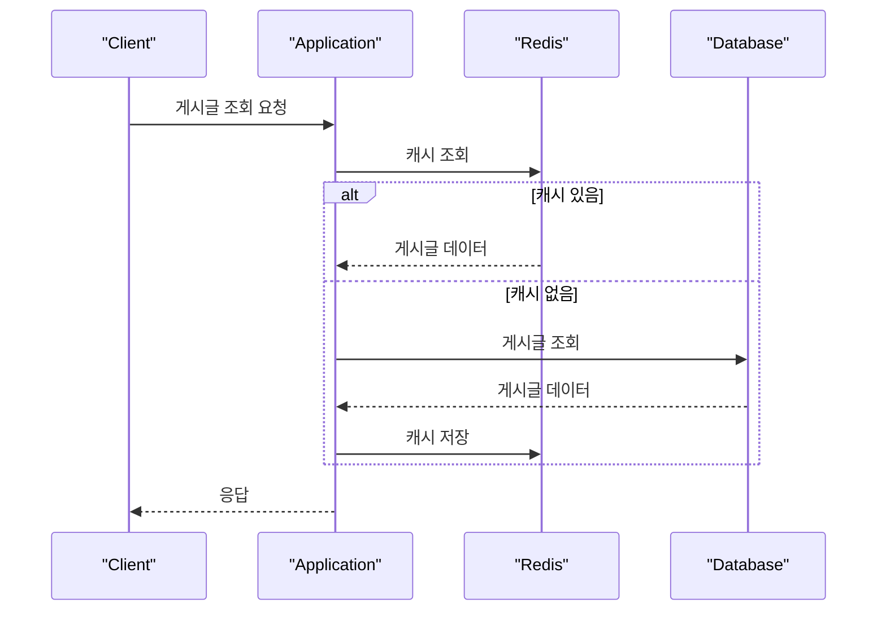
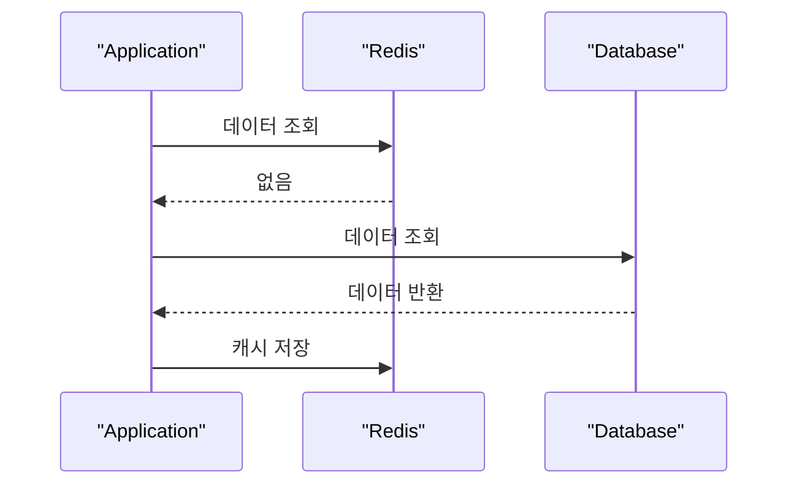

# Redis

## 1. Redis란?

Redis는 메모리에 데이터를 저장하는 key-value 기반의 NoSQL 데이터베이스다.

디스크가 아니라 메모리를 중심으로 동작하기 때문에 매우 빠른 읽기와 쓰기가 가능하다. 그래서 캐시, 세션 저장소, 랭킹, 분산 락, 메시지 처리 같은 곳에서 자주 사용된다.

면접에서는 보통 다음 정도로 답하면 된다.

> Redis는 메모리 기반의 key-value 저장소입니다. 문자열뿐 아니라 List, Set, Hash, Sorted Set 같은 다양한 자료구조를 지원하고, 빠른 조회가 필요한 캐시나 세션 저장소 등에 많이 사용됩니다.

## 2. Redis의 특징

Redis의 핵심 특징은 다음과 같다.

- 메모리 기반이라 읽기와 쓰기가 빠르다.
- key-value 구조를 사용한다.
- 다양한 자료구조를 지원한다.
- TTL을 설정해 데이터 만료 시간을 지정할 수 있다.
- RDB, AOF 방식으로 데이터를 디스크에 저장할 수 있다.
- 단일 스레드 이벤트 루프 기반으로 명령을 처리한다.

Redis는 단순히 "빠른 캐시"만은 아니다.

자료구조를 제공하기 때문에 애플리케이션에서 복잡하게 구현해야 할 기능을 Redis 명령어로 간단히 처리할 수 있다.

## 3. Redis 자료구조

Redis는 value에 여러 자료구조를 저장할 수 있다.

| 자료구조 | 설명 | 자주 쓰는 예시 |
| --- | --- | --- |
| String | 가장 기본적인 문자열 값 | 캐시, 카운터 |
| List | 순서가 있는 문자열 목록 | 큐, 최근 본 목록 |
| Set | 중복 없는 집합 | 태그, 중복 제거 |
| Sorted Set | 점수를 기준으로 정렬되는 집합 | 랭킹, 우선순위 |
| Hash | field-value 구조 | 객체 정보 저장 |
| Bitmap | 비트 단위 데이터 | 출석 체크, 방문 여부 |
| HyperLogLog | 대략적인 고유 개수 계산 | UV 추정 |
| Stream | 로그형 메시지 저장 | 메시지 큐, 이벤트 처리 |

### String

String은 가장 기본적인 자료구조다.

```text
SET user:1:name "라이"
GET user:1:name
```

단순한 값 저장뿐 아니라 숫자 증가에도 사용할 수 있다.

```text
INCR post:1:view_count
```

조회수, 좋아요 수처럼 빠르게 증가시키는 값에 사용할 수 있다.

### Hash

Hash는 하나의 key 안에 여러 field-value를 저장한다.

```text
HSET user:1 name "라이" age 25
HGET user:1 name
```

회원 정보처럼 작은 객체를 저장할 때 사용할 수 있다.

### List

List는 입력 순서를 유지하는 목록이다.

```text
LPUSH recent:products 1001
LPUSH recent:products 1002
LRANGE recent:products 0 9
```

최근 본 상품, 간단한 큐 같은 기능에 사용할 수 있다.

### Set

Set은 중복을 허용하지 않는 집합이다.

```text
SADD post:1:likes user:1
SADD post:1:likes user:2
SISMEMBER post:1:likes user:1
```

좋아요를 누른 사용자 목록이나 중복 제거가 필요한 곳에 사용할 수 있다.

### Sorted Set

Sorted Set은 각 값에 score를 붙여 정렬하는 자료구조다.

```text
ZADD ranking 1500 user:1
ZADD ranking 2100 user:2
ZREVRANGE ranking 0 9 WITHSCORES
```

게임 점수 랭킹, 인기 게시글, 우선순위 목록에 자주 사용된다.

## 4. Redis는 왜 빠를까?

Redis가 빠른 이유는 크게 세 가지로 볼 수 있다.

첫째, 데이터를 메모리에 저장한다. 디스크 접근보다 메모리 접근이 훨씬 빠르기 때문에 조회 속도가 빠르다.

둘째, 단일 스레드 이벤트 루프 방식으로 명령을 처리한다. 여러 명령을 동시에 실행하다가 락 경쟁이 생기는 구조가 아니라, 한 번에 하나의 명령을 빠르게 처리한다.

셋째, Redis 명령어 대부분은 시간 복잡도가 낮은 자료구조 연산이다. key로 값을 찾거나, Set에 값이 있는지 확인하거나, Sorted Set에서 순위를 조회하는 작업을 효율적으로 처리할 수 있다.

다만 단일 스레드라는 말은 Redis가 항상 병렬 처리를 못 한다는 뜻은 아니다. 네트워크 I/O, 백그라운드 저장 작업 등은 별도 스레드를 사용할 수 있다. 중요한 것은 Redis 명령 실행이 주로 단일 스레드에서 순차적으로 처리된다는 점이다.

## 5. 캐시로 사용하는 Redis

Redis는 캐시 저장소로 많이 사용된다.

캐시는 자주 조회되는 데이터를 미리 저장해두고, 다음 요청에서 빠르게 반환하는 방식이다.



이 구조에서는 Redis에 데이터가 있으면 DB까지 가지 않아도 된다. 그래서 DB 부하를 줄이고 응답 속도를 높일 수 있다.

### Cache Hit과 Cache Miss

Cache Hit은 캐시에 원하는 데이터가 있는 상황이다.

Cache Miss는 캐시에 원하는 데이터가 없는 상황이다. 이때는 원본 데이터베이스에서 데이터를 조회한 뒤 Redis에 저장할 수 있다.

### TTL

TTL은 Time To Live의 약자다.

Redis에서는 key에 만료 시간을 설정할 수 있다.

```text
SET session:abc123 user:1 EX 1800
```

위 명령은 `session:abc123` key를 1800초 동안만 유지한다.

TTL은 세션, 인증 코드, 임시 데이터, 캐시 데이터처럼 일정 시간이 지나면 사라져도 되는 데이터에 유용하다.

## 6. 캐시 전략

Redis를 캐시로 사용할 때는 데이터를 어떻게 읽고 쓸지 정해야 한다.

### Cache Aside

애플리케이션이 캐시와 DB를 직접 다루는 방식이다.

조회할 때 Redis를 먼저 확인하고, 없으면 DB에서 조회한 뒤 Redis에 저장한다.

가장 많이 사용하는 방식이다.



장점은 구현이 단순하고 필요한 데이터만 캐시에 저장할 수 있다는 점이다.

단점은 Cache Miss가 발생하면 DB 조회까지 필요해서 응답이 느려질 수 있다는 점이다.

### Write Through

데이터를 쓸 때 Redis와 DB에 함께 저장하는 방식이다.

캐시와 DB를 함께 갱신하므로 캐시 데이터가 비교적 최신 상태를 유지할 수 있다.

단점은 쓰기 작업이 느려질 수 있고, 자주 조회되지 않는 데이터까지 캐시에 저장될 수 있다는 점이다.

### Write Back

데이터를 먼저 Redis에 쓰고, 나중에 DB에 반영하는 방식이다.

쓰기 성능은 좋지만 Redis 장애가 발생하면 DB에 반영되지 않은 데이터가 사라질 수 있다. 따라서 정합성이 중요한 데이터에는 조심해서 사용해야 한다.

## 7. Redis 영속성

Redis는 메모리 기반이지만 데이터를 디스크에 저장하는 기능도 제공한다.

대표적인 방식은 RDB와 AOF다.

### RDB

RDB는 특정 시점의 Redis 데이터를 스냅샷으로 저장하는 방식이다.

장점은 파일 크기가 비교적 작고 복구가 빠르다는 점이다.

단점은 스냅샷 이후 장애가 발생하면 그 사이의 데이터는 잃을 수 있다는 점이다.

### AOF

AOF는 Redis에 실행된 쓰기 명령을 로그처럼 기록하는 방식이다.

장점은 RDB보다 데이터 손실을 줄일 수 있다는 점이다.

단점은 파일 크기가 커질 수 있고, 복구할 때 명령을 다시 실행해야 하므로 시간이 더 걸릴 수 있다는 점이다.

### 비교

| 구분 | RDB | AOF |
| --- | --- | --- |
| 저장 방식 | 특정 시점 스냅샷 | 쓰기 명령 로그 |
| 장점 | 복구가 빠르고 파일이 작음 | 데이터 손실을 줄이기 좋음 |
| 단점 | 최근 변경 데이터가 사라질 수 있음 | 파일이 커지고 복구가 느릴 수 있음 |

실무에서는 RDB와 AOF를 함께 사용하기도 한다.

## 8. Redis를 사용할 때 주의할 점

Redis는 빠르지만 모든 데이터를 Redis에 넣으면 안 된다.

Redis는 메모리 기반이라 저장 가능한 데이터 양이 서버 메모리에 영향을 받는다. 따라서 key가 계속 쌓이면 메모리 부족이 발생할 수 있다.

### 큰 key를 피해야 한다

하나의 key에 너무 큰 데이터를 저장하면 Redis 명령 처리 시간이 길어질 수 있다.

Redis는 명령을 주로 단일 스레드에서 처리하기 때문에, 오래 걸리는 명령 하나가 다른 요청까지 지연시킬 수 있다.

예를 들어 아주 큰 List 전체를 한 번에 조회하거나, 너무 많은 데이터를 가진 key를 삭제하면 문제가 될 수 있다.

### 만료 시간을 잘 설정해야 한다

캐시 데이터나 임시 데이터에는 TTL을 설정하는 것이 좋다.

TTL 없이 key를 계속 추가하면 메모리가 계속 증가할 수 있다.

### 캐시 데이터 정합성을 고려해야 한다

DB 데이터가 변경되었는데 Redis 캐시가 그대로 남아 있으면 오래된 데이터를 응답할 수 있다.

그래서 데이터 변경 시 캐시를 삭제하거나 갱신하는 전략이 필요하다.

### Redis 장애 상황을 고려해야 한다

Redis를 캐시로 사용한다면 Redis 장애 시 DB에서 직접 조회하도록 설계할 수 있다.

하지만 Redis를 세션 저장소나 분산 락처럼 핵심 기능에 사용한다면 Redis 장애가 서비스 장애로 이어질 수 있다. 이 경우 복제, Sentinel, Cluster 같은 구성을 고려해야 한다.

## 9. Redis의 고가용성

Redis를 운영할 때는 장애 상황도 고려해야 한다.

### Replication

Replication은 Redis 데이터를 다른 Redis 서버에 복제하는 방식이다.

보통 master가 쓰기를 담당하고 replica가 데이터를 복제받는다.

이를 통해 읽기 부하를 분산하거나, master 장애 시 replica를 승격해 사용할 수 있다.

### Sentinel

Sentinel은 Redis master의 장애를 감지하고, replica 중 하나를 새로운 master로 승격하는 기능을 제공한다.

Redis 서버가 죽었을 때 사람이 직접 조치하지 않아도 자동으로 장애 조치를 할 수 있도록 돕는다.

### Cluster

Redis Cluster는 데이터를 여러 Redis 노드에 나누어 저장하는 방식이다.

데이터를 샤딩해서 저장하므로 더 많은 데이터를 처리할 수 있고, 여러 노드로 부하를 분산할 수 있다.

다만 Cluster를 사용하면 키 설계, 멀티 키 명령 제한, 장애 대응 방식 등을 더 신경 써야 한다.

## 10. Redis 사용 예시

### 세션 저장소

로그인한 사용자의 세션 정보를 Redis에 저장할 수 있다.

TTL을 설정하면 일정 시간이 지난 세션을 자동으로 만료시킬 수 있다.

```text
SET session:token123 user:1 EX 3600
```

### 캐시

자주 조회되는 게시글, 상품 정보, 인기 검색어 등을 Redis에 저장할 수 있다.

DB 조회를 줄이고 응답 속도를 높일 수 있다.

### 랭킹

Sorted Set을 사용하면 점수 기반 랭킹을 쉽게 구현할 수 있다.

```text
ZADD score:ranking 1200 user:1
ZADD score:ranking 900 user:2
ZREVRANGE score:ranking 0 9 WITHSCORES
```

### 분산 락

여러 서버에서 동시에 같은 작업을 수행하지 않도록 Redis를 이용해 락을 구현할 수 있다.

다만 분산 락은 만료 시간, 락 해제 주체, 장애 상황을 신중히 고려해야 한다.

단순히 `SETNX`만 사용하면 락이 영원히 남거나, 다른 요청의 락을 잘못 해제하는 문제가 생길 수 있다.

## 11. 자주 나오는 면접 질문

### Q1. Redis란 무엇인가요?

Redis는 메모리 기반의 key-value NoSQL 데이터베이스입니다. 읽기와 쓰기가 빠르고, String, List, Set, Hash, Sorted Set 같은 다양한 자료구조를 지원합니다.

주로 캐시, 세션 저장소, 랭킹, 분산 락, 메시지 처리 등에 사용됩니다.

### Q2. Redis는 왜 빠른가요?

Redis는 데이터를 메모리에 저장하기 때문에 디스크 기반 데이터베이스보다 접근 속도가 빠릅니다.

또한 명령 처리를 주로 단일 스레드 이벤트 루프에서 수행해 락 경쟁 비용을 줄이고, 효율적인 자료구조 연산을 제공합니다.

### Q3. Redis는 단일 스레드인데 왜 빠른가요?

Redis의 주요 명령 처리는 단일 스레드에서 순차적으로 실행됩니다. 그래서 멀티 스레드에서 발생할 수 있는 락 경쟁이나 컨텍스트 스위칭 비용이 적습니다.

그리고 대부분의 작업이 메모리에서 빠르게 끝나기 때문에 단일 스레드여도 높은 성능을 낼 수 있습니다.

다만 오래 걸리는 명령을 실행하면 다른 요청도 지연될 수 있으므로 큰 key나 무거운 명령은 조심해야 합니다.

### Q4. Redis를 캐시로 사용할 때 주의할 점은 무엇인가요?

캐시 데이터와 DB 데이터의 정합성을 고려해야 합니다.

DB 데이터가 변경되었는데 캐시가 갱신되지 않으면 오래된 데이터를 응답할 수 있습니다. 따라서 데이터 변경 시 캐시를 삭제하거나 갱신하는 전략이 필요합니다.

또한 TTL을 설정해 메모리가 계속 증가하지 않도록 관리해야 합니다.

### Q5. RDB와 AOF의 차이는 무엇인가요?

RDB는 특정 시점의 데이터를 스냅샷으로 저장하는 방식입니다. 복구가 빠르고 파일이 작지만, 스냅샷 이후 변경 데이터는 장애 시 사라질 수 있습니다.

AOF는 쓰기 명령을 로그로 기록하는 방식입니다. 데이터 손실을 줄이기 좋지만 파일이 커질 수 있고, 복구 시간이 길어질 수 있습니다.

### Q6. Redis와 일반 데이터베이스의 차이는 무엇인가요?

Redis는 메모리 기반이라 빠르지만, 저장 공간이 메모리에 제한되고 영속성이나 복잡한 관계 처리에는 한계가 있습니다.

일반적인 관계형 데이터베이스는 디스크 기반으로 많은 데이터를 안정적으로 저장하고, 트랜잭션과 관계형 조회에 강합니다.

그래서 Redis는 보통 핵심 데이터를 영구 저장하는 메인 데이터베이스보다는 캐시나 보조 저장소로 많이 사용됩니다.

## 12. 정리

Redis는 메모리 기반의 빠른 key-value 저장소다.

단순한 문자열 저장뿐 아니라 List, Set, Hash, Sorted Set 같은 자료구조를 지원하기 때문에 캐시, 세션, 랭킹, 분산 락 등 다양한 기능에 활용할 수 있다.

하지만 Redis는 메모리 기반이므로 key 관리, TTL, 데이터 정합성, 장애 대응을 함께 고려해야 한다.

핵심은 다음 세 가지다.

- Redis는 빠른 메모리 기반 key-value 저장소다.
- 다양한 자료구조와 TTL을 제공해 캐시, 세션, 랭킹 등에 활용된다.
- 캐시 정합성, 메모리 관리, 장애 대응을 고려해야 안정적으로 사용할 수 있다.
