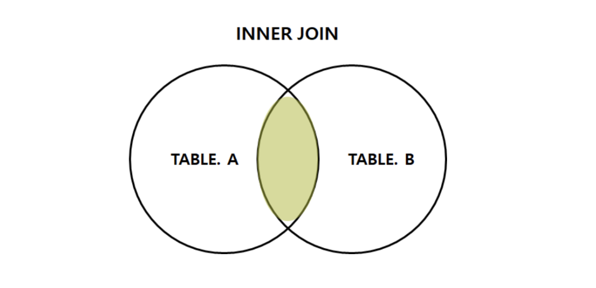
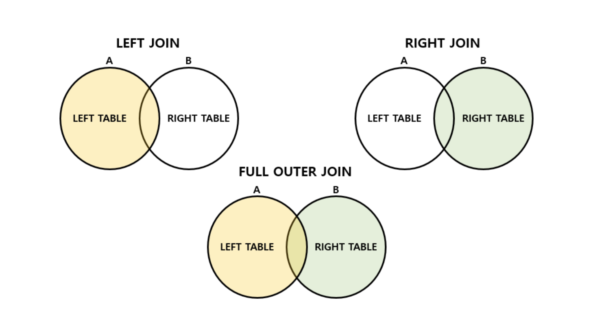
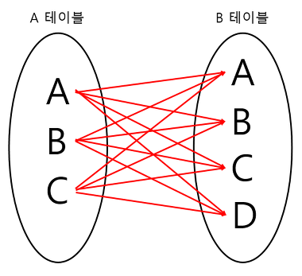
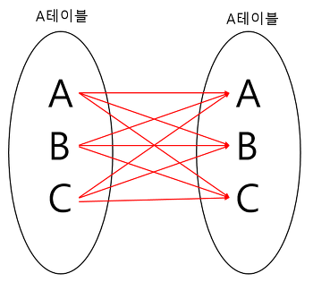

# SQL - JOIN

## 학습 목표

- JOIN의 개념과 필요성을 설명할 수 있다.
- INNER JOIN과 OUTER JOIN의 차이를 설명할 수 있다.
- ON 조건절과 USING 조건절의 차이를 설명할 수 있다.
- LEFT / RIGHT / FULL OUTER JOIN의 차이를 설명할 수 있다.

---

## JOIN이란?

관계형 데이터베이스에서, 두 개 이상의 테이블 연결하여 데이터를 검색하는 방법이다.

여러 개의 테이블을 마치 하나의 테이블인 것처럼 활용할 수 있다.

### JOIN이 왜 필요할까?

JOIN을 사용하는 이유는 정규화로 인해 분리된 테이블들에서 원하는 데이터를 함께 조회하기 위함이다.

관계형 데이터베이스에서 정규화를 수행하면 중복이 최소화되고 데이터 무결성이 향상되지만, 관련 데이터가 여러 테이블에 나뉘어 저장된다.

이렇게 분리된 데이터를 하나의 결과로 조회하기 위해 JOIN이 필요하다.

---

## JOIN의 종류

### INNER JOIN

두 테이블의 공통 속성(교집합)을 가진 튜플들을 보여준다.



#### 표현 방법

##### 암묵적 표현 (Implicit JOIN = EQUI JOIN)

- `=` 연산자를 사용하며, 조인 조건을 WHERE 절에 작성
- FROM 절에 테이블을 쉼표로 나열하는 예전 방식
- 단점: WHERE 절에 조인 조건과 필터 조건이 섞여 가독성이 떨어짐

```sql
SELECT *
FROM tb_user u, tb_office o
WHERE u.user_no = o.user_no
```

##### 명시적 표현 (Explicit JOIN)

- FROM 절에 `INNER JOIN` 키워드를 직접 명시하고, 조인 조건을 `ON` 또는 `USING`으로 분리하는 방식
- WHERE 절에는 순수한 필터 조건만 남아 가독성이 향상됨
- ON 조건절과 USING 조건절로 나뉨

아래 쿼리는 같은 동작을 한다.

```sql
-- ON 사용
SELECT u.*, o.*
FROM tb_user u
INNER JOIN tb_office o
ON u.user_no = o.user_no;

-- USING 사용
SELECT u.*, o.*
FROM tb_user u
INNER JOIN tb_office o
USING (user_no);
```

**USING 조건절**

- 두 테이블에 **이름이 같은 컬럼**을 조인할 때 사용 (항상 `=` 조건만 가능, ON은 `>`, `BETWEEN` 등도 허용)
- USING에 지정한 컬럼에는 테이블 별칭(접두사)을 붙일 수 없음 (`u.user_no` → 불가, `user_no` → 가능)
- 1개 이상의 컬럼을 지정할 수 있음

```sql
-- user_no 컬럼이 두 테이블 모두에 같은 이름으로 존재할 때 사용 가능
SELECT *
FROM tb_user u
JOIN tb_office o USING (user_no)
```

```sql
-- 에러: USING에 지정한 컬럼에 별칭 사용 불가
SELECT u.user_no
FROM tb_user u
JOIN tb_office o USING (user_no)

-- 정상
SELECT user_no
FROM tb_user u
JOIN tb_office o USING (user_no)
```

```sql
-- user_no와 dept_no 둘 다 같아야 조인 (다중 컬럼 지정)
SELECT *
FROM tb_user u
JOIN tb_office o USING (user_no, dept_no)
```

**ON 조건절**

- 컬럼명이 다르더라도 JOIN 조건을 사용할 수 있음
- `=` 외에 `>`, `<`, `BETWEEN` 등 다양한 조건도 사용 가능
- 테이블이 많아질수록 ON 조건이 쌓여 가독성이 떨어질 수 있음

```sql
-- office_id와 office_no는 같은 데이터지만 컬럼 이름이 다름 => USING 불가, ON만 가능
SELECT u.user_name, o.office_no, o.office_name
FROM tb_user u
JOIN tb_office o
ON u.office_id = o.office_no;
```

```sql
-- ON 사용: 테이블이 많아질수록 ON 조건이 쌓여 가독성이 떨어짐
SELECT *
FROM tb_user u
JOIN tb_order o ON u.user_no = o.user_no
JOIN tb_product p ON o.product_no = p.product_no
JOIN tb_category c ON p.category_no = c.category_no
JOIN tb_delivery d ON o.order_no = d.order_no

-- USING 사용: 컬럼명이 같을 때만 가능하지만 조건이 짧아 상대적으로 읽기 편함
SELECT *
FROM tb_user u
JOIN tb_order o USING (user_no)
JOIN tb_product p USING (product_no)
JOIN tb_category c USING (category_no)
JOIN tb_delivery d USING (order_no)
```

### OUTER JOIN

- INNER JOIN과 달리, 조인 조건에 해당하지 않는 행도 결과에 포함한다.
- 기준이 되는 테이블의 모든 행을 유지하고, 매칭되는 행이 없으면 NULL로 채운다.
- USING, ON 조건절을 필수로 사용한다.



- **기준 테이블**: LEFT JOIN이면 왼쪽, RIGHT JOIN이면 오른쪽 테이블
    - OUTER JOIN에서는 기준 테이블 = 드라이빙 테이블로 고정된다.

> **드라이빙 테이블**: 어느 테이블을 먼저 읽을지 결정 → 실행 순서 관련 개념
> - 드라이빙 테이블을 한 행씩 스캔하면서, 각 행의 조인 조건 값으로 상대 테이블을 조회해 일치하는 행을 찾아 붙임
> - 상대 테이블에 인덱스가 있으면 드라이빙 테이블 행 수만큼만 조회가 발생하지만, 인덱스가 없으면 드라이빙 행마다 상대 테이블 전체를 스캔하므로 비용이 급격히 커짐
> - **WHERE 등 필터 조건 적용 후 행 수가 적은 테이블을 드라이빙 테이블로 잡는 것이 좋음** (드라이빙 행 수 = 상대 테이블 조회 횟수이므로)
> - 개발자가 직접 판단하기 어렵기 때문에, INNER JOIN에서는 옵티마이저가 테이블 통계 정보를 바탕으로 자동으로 결정 (FROM 순서와 무관)
> - OUTER JOIN에서는 기준 테이블을 바꾸면 결과 자체가 달라지므로, 기준 테이블이 드라이빙 테이블로 고정됨


아래 예시 데이터를 기준으로 각 JOIN 결과를 비교한다.

```
tb_user                      tb_order
user_no | user_name           order_no | user_no
   1    | Alice                  1     |    1
   2    | Bob                    2     |    1
   3    | Charlie                3     |    99   ← 존재하지 않는 유저의 주문
```

#### LEFT OUTER JOIN

- **왼쪽 테이블 기준**: 왼쪽 테이블의 모든 행을 유지
- 오른쪽 테이블에 매칭되는 행이 없으면 NULL로 채움
- `LEFT JOIN`으로 생략 가능

```sql
SELECT u.user_no, u.user_name, o.order_no
FROM tb_user u
LEFT JOIN tb_order o ON u.user_no = o.user_no;
```

```
user_no | user_name | order_no
   1    | Alice     |    1
   1    | Alice     |    2
   2    | Bob       |   NULL  ← 주문 없는 유저, NULL로 채워짐
   3    | Charlie   |   NULL  ← 주문 없는 유저, NULL로 채워짐
```

#### RIGHT OUTER JOIN

- **오른쪽 테이블 기준**: 오른쪽 테이블의 모든 행을 유지
- 왼쪽 테이블에 매칭되는 행이 없으면 NULL로 채움
- `RIGHT JOIN`으로 생략 가능

```sql
SELECT u.user_no, u.user_name, o.order_no
FROM tb_user u
RIGHT JOIN tb_order o ON u.user_no = o.user_no;
```

```
user_no | user_name | order_no
   1    | Alice     |    1
   1    | Alice     |    2
  NULL  |   NULL    |    3    ← 유저 없는 주문, NULL로 채워짐
```

#### FULL OUTER JOIN

- **양쪽 테이블 모두 기준**: LEFT JOIN + RIGHT JOIN 결과의 합집합
- 어느 쪽이든 매칭되는 행이 없으면 NULL로 채움
- 중복 행은 제거됨 (UNION과 동일, UNION ALL 아님)
- `FULL JOIN`으로 생략 가능

```sql
SELECT u.user_no, u.user_name, o.order_no
FROM tb_user u
FULL JOIN tb_order o ON u.user_no = o.user_no;
```

```
user_no | user_name | order_no
   1    | Alice     |    1
   1    | Alice     |    2
   2    | Bob       |   NULL  ← 주문 없는 유저
   3    | Charlie   |   NULL  ← 주문 없는 유저
  NULL  |   NULL    |    3    ← 유저 없는 주문
```

### CROSS JOIN

- Cartesian Product(카르테시안 곱)라고도 함
- 두 테이블 간 조인 조건 없이 **가능한 모든 행의 조합**을 반환
- 결과 행 수 = N(왼쪽 테이블 행 수) × M(오른쪽 테이블 행 수)
- 조인 조건을 실수로 빠뜨렸을 때 의도치 않게 발생할 수 있어 주의 필요



```sql
-- tb_user 3행 × tb_office 2행 = 6행 반환
SELECT u.user_name, o.office_name
FROM tb_user u
CROSS JOIN tb_office o;
```

```
user_name | office_name
Alice     | Office A
Alice     | Office B
Bob       | Office A
Bob       | Office B
Charlie   | Office A
Charlie   | Office B
```

### SELF JOIN

- 같은 테이블을 두 번 참조하여 자기 자신과 조인하는 방식
- 테이블 내에 **계층 구조**(상위-하위 관계)가 있을 때 주로 사용
- 같은 테이블을 별칭으로 구분하여 사용



보통 FK는 다른 테이블의 PK를 참조하는데, SELF JOIN은 FK가 **자기 자신 테이블의 PK**를 참조할 때 필요하다.

아래 예시에서 `manager_no`는 같은 `tb_user` 테이블의 `user_no`를 참조하는 FK다.
Bob의 `manager_no = 1` → 같은 테이블에서 `user_no = 1`인 Alice를 가리킨다.

```
tb_user
user_no | user_name | manager_no
   1    | Alice     |   NULL      ← 관리자 없음 (최상위)
   2    | Bob       |    1        ← user_no=1 (Alice)을 참조
   3    | Charlie   |    1        ← user_no=1 (Alice)을 참조
   4    | Dave      |    2        ← user_no=2 (Bob)을 참조
```

다른 테이블이 없으니 같은 테이블을 `u`(직원)와 `m`(관리자)으로 별칭을 나눠 두 번 읽어서 조인한다.

```sql
-- 각 유저와 그 유저를 관리하는 매니저 이름 조회
SELECT u.user_name AS 유저, m.user_name AS 매니저
FROM tb_user u
JOIN tb_user m ON u.manager_no = m.user_no;
```

```
유저    | 매니저
Bob     | Alice
Charlie | Alice
Dave    | Bob
```

---

## JOIN을 사용할 때 주의할 점

- **조인 조건을 명확하게 명시해야 한다.**
  - 조인 조건을 빠뜨리면 의도치 않게 CROSS JOIN이 수행되어 대량의 데이터가 반환될 수 있다.

- **조인 전에 대상 집합을 최소화한다.**
  - WHERE 조건 등으로 먼저 필터링하여 조인할 행 수를 줄인 후 조인하는 것이 효율적이다.

- **조인 컬럼에 인덱스를 활용한다.**
  - 인덱스가 없으면 상대 테이블을 매번 전체 스캔하므로, 조인 조건 컬럼에 인덱스를 걸면 조인 비용을 크게 낮출 수 있다.

---

### 참고 자료

https://im-codding.tistory.com/64#google_vignette

https://velog.io/@newdana01/Database-%ED%85%8C%EC%9D%B4%EB%B8%94-%EC%A1%B0%EC%9D%B8-%EC%9D%B4%ED%95%B4%ED%95%98%EA%B8%B0
