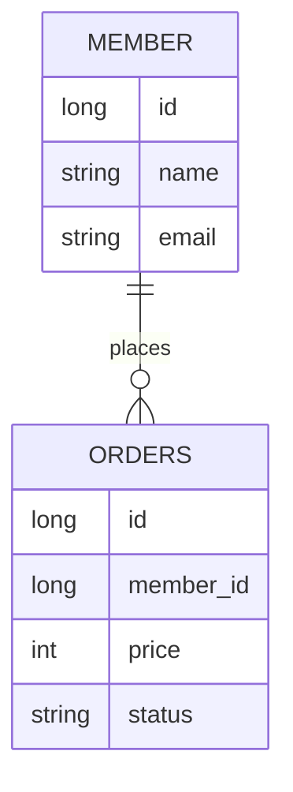

# SQL vs NoSQL

## 1. SQL과 NoSQL의 큰 차이

SQL과 NoSQL은 데이터를 저장하고 조회하는 방식이 다르다.

SQL 데이터베이스는 정해진 테이블 구조에 데이터를 저장한다. 행과 열로 구성된 테이블을 만들고, 테이블 사이의 관계를 정의한 뒤 SQL을 사용해 데이터를 조회한다.

NoSQL 데이터베이스는 SQL 데이터베이스보다 더 유연한 구조로 데이터를 저장한다. 문서, 키-값, 컬럼 패밀리, 그래프 등 다양한 형태가 있으며, 서비스 특성에 맞게 데이터를 저장하고 조회하는 데 초점을 둔다.

면접에서는 보통 다음 정도로 답하면 된다.

> SQL은 정해진 스키마와 관계를 기반으로 데이터를 저장하는 관계형 데이터베이스이고, NoSQL은 더 유연한 데이터 모델을 사용해 확장성과 빠른 처리를 중시하는 비관계형 데이터베이스입니다.

## 2. SQL 데이터베이스

SQL 데이터베이스는 관계형 데이터베이스라고도 부른다.

대표적인 예시는 MySQL, PostgreSQL, Oracle, SQL Server가 있다.

### 특징

- 데이터를 테이블 형태로 저장한다.
- 스키마가 명확하다.
- 테이블 사이의 관계를 외래 키로 표현할 수 있다.
- SQL을 사용해 데이터를 조회하고 조작한다.
- 트랜잭션과 데이터 정합성을 중요하게 다룬다.

예를 들어 회원과 주문 데이터를 저장한다고 해보자.

회원 테이블에는 회원 정보가 있고, 주문 테이블에는 주문 정보가 있다. 주문 테이블은 회원 ID를 외래 키로 가지고 있어서 "어떤 회원이 어떤 주문을 했는지" 관계를 표현할 수 있다.



이런 구조는 데이터 중복을 줄이고, 관계가 명확한 데이터를 관리하기 좋다.

### 장점

- 데이터 구조가 명확해서 일관성을 지키기 쉽다.
- JOIN을 통해 여러 테이블의 데이터를 함께 조회할 수 있다.
- 트랜잭션을 통해 데이터 정합성을 보장하기 좋다.
- 오래 사용된 기술이라 안정적이고 자료가 많다.

### 단점

- 스키마 변경이 번거로울 수 있다.
- 테이블 관계가 복잡해지면 JOIN 비용이 커질 수 있다.
- 수평 확장이 NoSQL에 비해 상대적으로 어렵다.

수평 확장은 서버를 여러 대 늘려 부하를 분산하는 방식이다. SQL 데이터베이스도 샤딩, 리플리케이션 등을 통해 확장할 수 있지만, 관계와 트랜잭션을 유지하면서 확장하려면 설계 난이도가 높아진다.

## 3. NoSQL 데이터베이스

NoSQL은 Not Only SQL이라는 의미로도 설명한다.

관계형 모델만 사용하지 않고, 데이터 특성에 따라 다양한 저장 방식을 제공한다.

대표적인 예시는 MongoDB, Redis, Cassandra, DynamoDB, Neo4j가 있다.

### 주요 종류

| 종류 | 설명 | 예시 |
| --- | --- | --- |
| 문서형 | JSON과 비슷한 문서 단위로 저장 | MongoDB |
| 키-값 | key로 value를 빠르게 조회 | Redis, DynamoDB |
| 컬럼 패밀리 | 대량의 데이터를 컬럼 단위로 분산 저장 | Cassandra, HBase |
| 그래프 | 노드와 관계를 중심으로 저장 | Neo4j |

### 문서형 예시

문서형 데이터베이스에서는 회원과 주문 정보를 하나의 문서에 함께 저장할 수도 있다.

```json
{
  "id": 1,
  "name": "라이",
  "email": "rai@example.com",
  "orders": [
    {
      "id": 100,
      "price": 30000,
      "status": "PAID"
    }
  ]
}
```

이 구조는 특정 회원과 그 회원의 주문 목록을 한 번에 보여줘야 하는 화면에서 편할 수 있다.

반대로 주문 정보만 따로 자주 분석하거나, 회원과 주문의 관계가 복잡해지면 중복 데이터 관리가 어려워질 수 있다.

### 장점

- 스키마가 유연해서 데이터 구조 변경에 대응하기 쉽다.
- 대량의 데이터를 분산 저장하고 처리하기 좋다.
- 특정 조회 패턴에 맞춰 데이터를 저장하면 빠르게 조회할 수 있다.
- 서비스 초기처럼 요구사항이 자주 바뀌는 상황에서 편할 수 있다.

### 단점

- 데이터 중복이 늘어날 수 있다.
- 중복 데이터를 직접 동기화해야 하는 경우가 있다.
- JOIN이 제한적이거나 지원되지 않는 경우가 많다.
- 강한 트랜잭션 보장이 SQL 데이터베이스보다 약한 경우가 있다.

NoSQL이라고 해서 트랜잭션이 아예 없는 것은 아니다. MongoDB나 DynamoDB처럼 트랜잭션 기능을 제공하는 제품도 있다. 다만 전통적인 관계형 데이터베이스처럼 복잡한 관계와 강한 정합성을 기본 전제로 설계된 것은 아니라는 점을 이해하면 된다.

## 4. 비교 정리

| 구분 | SQL | NoSQL |
| --- | --- | --- |
| 데이터 모델 | 테이블 | 문서, 키-값, 컬럼, 그래프 등 |
| 스키마 | 고정된 스키마 | 유연한 스키마 |
| 관계 표현 | 외래 키, JOIN | 보통 데이터 중복 또는 참조 |
| 정합성 | 강한 정합성에 유리 | 확장성과 가용성에 유리한 경우가 많음 |
| 확장 방식 | 주로 수직 확장, 샤딩 가능 | 수평 확장에 유리 |
| 적합한 상황 | 관계가 중요하고 트랜잭션이 중요한 서비스 | 대규모 데이터, 빠른 조회, 유연한 구조가 중요한 서비스 |
| 예시 | MySQL, PostgreSQL, Oracle | MongoDB, Redis, Cassandra, DynamoDB |

수직 확장은 한 서버의 CPU, 메모리, 디스크 성능을 높이는 방식이다.

수평 확장은 서버 여러 대에 데이터를 나누어 저장하거나 요청을 분산하는 방식이다.

## 5. 언제 SQL을 선택할까?

SQL은 데이터의 관계와 정합성이 중요한 경우에 적합하다.

예를 들어 은행, 결제, 주문, 예약 시스템처럼 데이터가 정확해야 하고 트랜잭션이 중요한 서비스에서는 SQL 데이터베이스가 잘 어울린다.

다음과 같은 상황이라면 SQL을 먼저 고려할 수 있다.

- 데이터 구조가 비교적 명확하다.
- 테이블 사이의 관계가 중요하다.
- 복잡한 조건 검색과 JOIN이 필요하다.
- 트랜잭션으로 정합성을 강하게 보장해야 한다.
- 중복 데이터를 줄이고 일관성 있게 관리해야 한다.

예를 들어 주문 서비스에서 결제 성공, 재고 차감, 주문 생성은 함께 성공하거나 함께 실패해야 한다. 이런 경우 SQL 데이터베이스의 트랜잭션이 큰 장점이 된다.

## 6. 언제 NoSQL을 선택할까?

NoSQL은 데이터 구조가 자주 바뀌거나, 대량의 데이터를 빠르게 저장하고 조회해야 하는 경우에 적합하다.

다음과 같은 상황이라면 NoSQL을 고려할 수 있다.

- 데이터 구조가 자주 바뀐다.
- 대규모 트래픽을 수평 확장으로 처리해야 한다.
- 특정 key로 빠르게 조회하는 패턴이 많다.
- 관계보다 조회 성능이나 확장성이 더 중요하다.
- 로그, 캐시, 세션, 피드, 알림처럼 대량 데이터 처리가 중요하다.

예를 들어 Redis는 key-value 구조라서 세션 저장소나 캐시로 많이 사용한다. MongoDB는 문서 구조가 유연해서 JSON 형태의 데이터를 다루기 편하다.

## 7. CAP 이론과 연결해서 보기

NoSQL을 이야기할 때 CAP 이론이 함께 나오는 경우가 많다.

CAP 이론은 분산 시스템에서 다음 세 가지를 모두 완벽하게 만족하기 어렵다는 내용이다.

- Consistency: 모든 노드가 같은 데이터를 보여주는 성질
- Availability: 요청이 들어오면 항상 응답할 수 있는 성질
- Partition Tolerance: 네트워크가 끊겨도 시스템이 계속 동작하는 성질

분산 환경에서는 네트워크 장애가 발생할 수 있기 때문에 Partition Tolerance를 포기하기 어렵다. 그래서 보통 Consistency와 Availability 사이에서 선택하게 된다.

SQL 데이터베이스는 전통적으로 강한 정합성을 중요하게 다루고, NoSQL 데이터베이스는 분산 환경에서 가용성과 확장성을 중요하게 다루는 경우가 많다.

다만 이것도 단순히 "SQL은 CP, NoSQL은 AP"처럼 외우면 위험하다. 실제 특성은 데이터베이스 제품과 설정에 따라 달라진다.

## 8. 자주 나오는 면접 질문

### Q1. SQL과 NoSQL의 차이는 무엇인가요?

SQL은 정해진 스키마를 가진 테이블에 데이터를 저장하고, 테이블 간 관계를 기반으로 데이터를 다룹니다. 반면 NoSQL은 문서, 키-값, 컬럼, 그래프 등 다양한 모델을 사용하며 스키마가 비교적 유연합니다.

SQL은 데이터 정합성과 복잡한 관계 처리에 강하고, NoSQL은 대규모 트래픽, 유연한 데이터 구조, 수평 확장에 유리한 경우가 많습니다.

### Q2. NoSQL은 SQL보다 항상 빠른가요?

항상 그렇지는 않습니다.

NoSQL은 특정 조회 패턴에 맞게 데이터를 저장하면 매우 빠를 수 있습니다. 하지만 복잡한 조건 검색이나 여러 데이터 간 관계를 함께 조회해야 하는 경우에는 SQL이 더 적합할 수 있습니다.

결국 성능은 데이터 모델, 인덱스, 쿼리 패턴, 데이터 양, 분산 구조에 따라 달라집니다.

### Q3. SQL과 NoSQL 중 무엇을 선택해야 하나요?

데이터의 관계와 정합성이 중요하면 SQL을 선택하는 것이 좋습니다.

반대로 데이터 구조가 유연해야 하거나, 대량 데이터를 분산 처리해야 하거나, 특정 조회 패턴에 최적화하고 싶다면 NoSQL을 고려할 수 있습니다.

실무에서는 둘 중 하나만 고르는 것이 아니라, 목적에 따라 함께 사용하는 경우도 많습니다. 예를 들어 핵심 주문 데이터는 MySQL에 저장하고, 조회 성능을 위한 캐시는 Redis에 저장할 수 있습니다.

### Q4. NoSQL은 스키마가 없나요?

완전히 스키마가 없다고 보기는 어렵습니다.

NoSQL은 데이터베이스가 강제하는 스키마가 약하거나 유연한 경우가 많다. 하지만 애플리케이션은 결국 어떤 필드가 들어오는지 알고 있어야 하므로, 스키마 관리 책임이 데이터베이스에서 애플리케이션 쪽으로 이동한다고 볼 수 있습니다.

### Q5. SQL 데이터베이스는 수평 확장이 불가능한가요?

불가능하지 않습니다.

SQL 데이터베이스도 리플리케이션, 파티셔닝, 샤딩 등을 통해 확장할 수 있습니다. 다만 테이블 간 관계와 트랜잭션을 유지하면서 여러 서버로 데이터를 나누는 것은 설계와 운영 난이도가 높을 수 있습니다.

## 9. 정리

SQL과 NoSQL은 누가 더 좋은지를 비교하는 기술이 아니다.

SQL은 명확한 스키마, 관계, 트랜잭션, 정합성이 중요한 상황에 잘 맞는다.

NoSQL은 유연한 데이터 구조, 대량 데이터 처리, 수평 확장, 특정 조회 패턴 최적화가 중요한 상황에 잘 맞는다.

핵심은 다음 세 가지다.

- SQL은 관계와 정합성에 강하다.
- NoSQL은 유연성과 확장성에 강하다.
- 실제 선택은 서비스의 데이터 구조, 조회 패턴, 정합성 요구사항을 기준으로 해야 한다.
