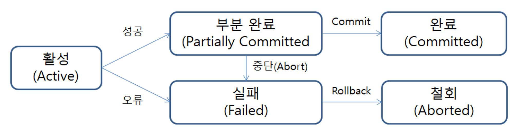

# Transaction

## 학습 목표

- 트랜잭션이 무엇인지 이해한다.
- 트랜잭션의 4가지 주요 특성(ACID)을 이해한다.

---

## 트랜잭션이 왜 필요할까?

### 트랜잭션이 없으면 벌어지는 일

다음 상황을 가정해보자.

```
여러 고객 계좌의 잔액과, 지점별 총 예금 잔액을 관리하는 은행 데이터베이스가 있다.
서여는 봉구스에게 10,000원을 송금하려고 한다.
```

이 작업을 SQL로 표현하면 다음과 같다.

```SQL
UPDATE accounts SET balance = balance - 10000 WHERE name = '서여';
-- 만약 여기서 서버가 죽거나 오류가 발생한다면?
UPDATE accounts SET balance = balance + 10000 WHERE name = '봉구스';
```

첫 번째 UPDATE만 실행되고 두 번째 UPDATE가 실행되지 않으면, 서여의 돈은 줄었지만 봉구스의 돈은 늘지 않는 상태가 된다. 즉, 10,000원이 허공으로 사라진다.

이처럼 하나의 작업을 완수하기 위해 여러 SQL이 필요한 경우, 중간에 실패하면 데이터가 망가진다. 

이 UPDATE들을 하나의 트랜잭션으로 묶으면, 전부 성공하거나 전부 취소되는 보장이 제공된다.

---

## 트랜잭션(Transaction)이란?

**데이터베이스의 상태를 변경시키는 작업의 단위**

> 상태를 변화시킨다는 것은, SQL 질의어를 통해 DB에 접근하는 것이다. <br>
> 작업 단위란, 많은 SQL 명령문들을 사람이 정하는 기준에 따라 정하는 것이다.

핵심은 여러 단계의 작업을 하나의 전부 아니면 전무(all-or-nothing) 연산으로 묶는다는 것이다.

데이터를 저장할 때 파일 저장이 아닌, 데이터베이스를 저장하는 이유 중, 대표적인 이유는 트랜잭션을 지원하기 때문이다.

```SQL
BEGIN; -- 트랜잭션 시작

UPDATE accounts SET balance = balance - 10000 WHERE name = '서여';
UPDATE accounts SET balance = balance + 10000 WHERE name = '봉구스';

COMMIT; -- 두 작업 모두 성공 => 영구 반영
-- 혹은
ROLLBACK; -- 하나라도 실패 => 전부 취소
```

- **COMMIT** : 트랜잭션 내 모든 작업이 성공적으로 완료되어 데이터베이스에 영구 반영되는 것
- **ROLLBACK** : 작업 중 하나라도 실패했을 때, 트랜잭션 시작 이전 상태로 되돌리는 것 (쿼리 처음부터 다시 실행)

---

## 트랜잭션의 특성: ACID

트랜잭션이 안전하게 수행된다는 것을 보장하기 위한 성질이다.

동시성 제어와 회복 기법을 활용하여 보장한다.

### Atomicity (원자성)

트랜잭션에 해당하는 작업이 DB에 모두 반영되거나, 전혀 반영되지 않아야 한다. (All or Nothing)

> 예시: 이체 도중 서버가 꺼져도, 출금과 입금은 둘 다 취소된다.

### Consistency (일관성)

트랜잭션이 완료된 다음의 상태에서도, 트랜잭션이 일어나기 전의 상황과 동일하게 데이터의 일관성을 보장해야 한다.

즉, 데이터베이스에서 정한 무결성 제약 조건을 항상 만족해야 한다.

> 예시: 이체 전후 모든 계좌의 잔액 합계는 동일하게 유지된다.

### Isolation (격리성)

각각의 트랜잭션은 서로 간섭없이, 독립적으로 수행되어야 한다.

즉, 진행 중인 트랜잭션의 중간 상태는 다른 트랜잭션에서 볼 수 없다.

> 예시: A와 B가 동시에 같은 계좌에 입금 처리를 해도, 서로의 중간 상태에 영향을 주지 않는다.

### Durability (지속성)

트랜잭션이 정상적으로 종료된 다음에는 영구적으로 데이터베이스에 작업의 결과가 저장되어야 한다.

> 예시: 이체 완료(COMMIT) 후 정전이 발생해도 이체 기록은 사라지지 않는다.

---

## 트랜잭션의 상태

트랜잭션은 실행되는 동안 아래와 같은 상태를 거쳐간다.



#### Active (활성)

트랜잭션이 실행 중인 활동 상태. 

INSERT, UPDATE, DELETE 같은 연산이 수행되며, 변경 내용은 아직 데이터베이스에 직접 저장되지 않고 메모리 버퍼에 임시 보관된다.

#### Failed (실패)

`Active` 또는 `Partially Committed` 상태에서 오류가 발생해 정상적인 진행이 불가능해진 상태. 

데이터베이스 복구 시스템이 개입하여 일관성 유지를 시도한다.

#### Partially Committed (부분 커밋)

마지막 SQL까지 실행이 완료됐지만, 아직 디스크에 영구 반영되지 않은 상태. 

COMMIT 명령이 도착했으나 실제 반영은 아직 이루어지지 않은 시점이다. 

이후 정상적으로 반영되면 `Committed` 상태로, 오류가 발생하면 `Failed` 상태로 전환된다.

#### Committed (커밋)

트랜잭션이 성공적으로 완료되어 모든 변경사항이 데이터베이스에 영구 저장된 상태.

> #### Partially Committed와 Committed 의 차이점 <br>
> Commit 요청이 들어오면, `Partially Committed` 상태가 된다. 이후, Commit을 문제없이 수행할 수 있으면 `Committed` 상태로 전이되고, 만약 오류가 발생하면, `Failed` 상태가 된다. <br>
> 즉, `Partially Committed`는 Commit 요청이 들어왔을 때를 말하며, `Committed`는 Commit을 정상적으로 완료한 상태를 말한다.

#### Aborted (중단)

트랜잭션이 롤백되어 데이터베이스가 트랜잭션 시작 이전 상태로 완전히 복원된 상태. 

이후 DBMS는 두 가지 중 하나를 선택한다.

- **트랜잭션 종료 (Kill)**: 다른 작업에 영향을 주지 않도록 트랜잭션을 강제 종료한다.
- **트랜잭션 재시작 (Restart)**: 필요한 조정을 거친 후, 트랜잭션을 다시 Active 상태로 되돌려 실행을 재시도한다.

#### Terminated (종료)

`Committed` 또는 `Aborted` 상태 이후 트랜잭션이 완전히 끝난 상태. 

더 이상 수행할 작업이 없으며, 데이터베이스는 안정적인 상태를 유지한다.

---

## 트랜잭션을 사용할 때 주의할 점

트랜잭션은 꼭 필요한 최소의 코드에만 적용하는 것이 좋다. 

즉, _**트랜잭션의 범위를 최소화**_ 하라는 의미다.

### 커넥션과 트랜잭션의 관계

애플리케이션이 데이터베이스에 SQL을 실행하려면 먼저 `커넥션(Connection)` 이라는 연결 통로를 열어야 한다.

커넥션을 매번 새로 여는 것은 비용이 크기 때문에, 실제 서비스에서는 미리 커넥션을 여러 개 만들어두고 필요할 때 꺼내 쓰는 `커넥션 풀(Connection Pool)` 을 사용한다.

커넥션 풀의 크기는 수십 개 수준으로 제한되어 있고, **트랜잭션은 커넥션 하나를 점유한 채로 실행**된다.

트랜잭션이 끝나야(COMMIT 또는 ROLLBACK) 비로소 커넥션이 반납된다.

각 단위 프로그램이 커넥션을 소유하는 시간이 길어진다면, 사용 가능한 여유 커넥션의 개수는 줄어들게 된다.

그러다 어느 순간에는 각 단위 프로그램에서 커넥션을 가져가기 위해 기다려야 하는 상황이 발생할 수도 있는 것이다.

```
// 나쁜 예 — 트랜잭션 안에 외부 API 호출이 있는 경우
트랜잭션 시작              ← 커넥션 점유 시작
  DB 조회
  외부 API 호출 (2~3초)    ← 이 동안 커넥션이 묶여 있음
  DB 업데이트
커밋                       ← 커넥션 반납

// 좋은 예 — DB 작업만 트랜잭션 안에 묶는 경우
외부 API 호출 (2~3초)      ← 트랜잭션 밖에서 처리
트랜잭션 시작              ← 커넥션 점유 시작
  DB 조회
  DB 업데이트
커밋                       ← 커넥션 반납
```

동시 요청이 많아지면 커넥션 풀의 커넥션이 전부 묶여버리고, 새 요청은 커넥션을 기다리다 타임아웃이 발생하기도 한다.

따라서 외부 API 호출, 파일 처리, 이메일 발송 같은 작업은 트랜잭션 밖으로 꺼내고, 트랜잭션 안에는 꼭 필요한 DB 작업만 남겨야 한다.

---

## 트랜잭션과 Lock

트랜잭션 작업에서 문제가 발생하는 요인 중 하나는, 세션 A에서 커밋을 수행하지 않았는데, 세션 B에서 동시에 같은 데이터를 수정하게 되는 경우다.

해당 경우에, 원자성이 위반된다.

이러한 문제를 방지하려면, 세션이 트랜잭션을 시작하고, 데이터를 수정하는 동안(커밋 또는 롤백 전까지) 다른 세션에서 해당 데이터를 수정할 수 없게 막아야 한다.

이것을 락(Lock)이라 한다.

---

### 참고 자료

https://www.postgresql.org/docs/current/tutorial-transactions.html

https://velog.io/@shasha/Database-%ED%8A%B8%EB%9E%9C%EC%9E%AD%EC%85%98-%EC%A0%95%EB%A6%AC#7-%EA%B5%90%EC%B0%A9%EC%83%81%ED%83%9C-deadlock---%EC%A0%95%EC%9D%98%EB%A7%8C-%EB%82%98%EB%A8%B8%EC%A7%80%EB%8A%94-%EC%B0%B8%EA%B3%A0

https://haburu23.tistory.com/25
