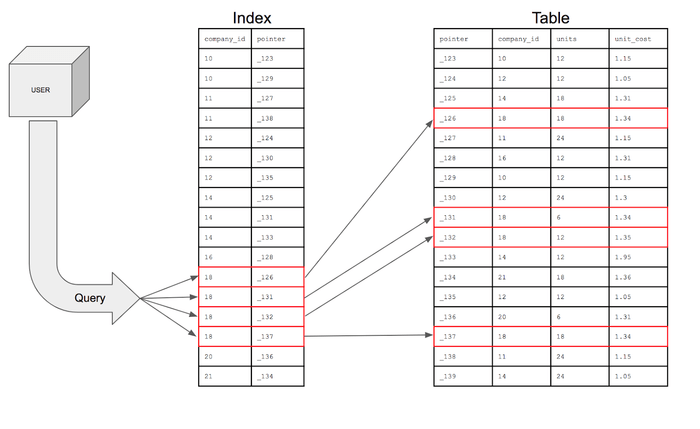
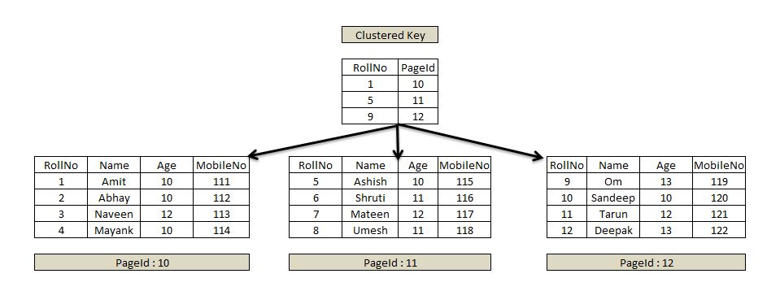
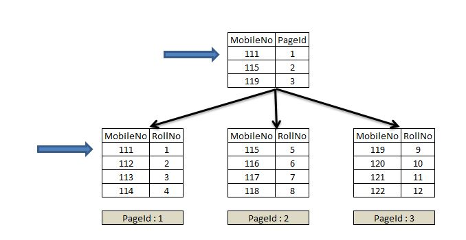

# Index

## 학습 목표

- 인덱스가 왜 필요한지, 어떤 문제를 해결하는지 설명할 수 있다.
- B+Tree가 DB 인덱스 자료구조로 사용되는 이유를 설명할 수 있다.
- Clustered Index와 Non-clustered Index의 차이를 설명할 수 있다.
- 인덱스를 어떤 상황에 사용해야 하는지 판단할 수 있다.

---

## index가 왜 필요할까?
데이터베이스에 데이터가 쌓이다 보면, 테이블 하나에 수백만 건의 행이 저장되는 경우가 흔하다. 
이 상태에서 특정 조건에 맞는 데이터를 찾으려면, 인덱스가 없을 경우 테이블의 첫 번째 행부터 마지막 행까지 전부 확인해야 한다. 
이를 Full Table Scan이라고 한다.

데이터가 100건일 때는 문제가 없지만, 1000만 건이 넘어가면 단순한 조회 쿼리 하나가 수 초씩 걸릴 수 있다. 

이 문제를 해결하기 위한 것이 바로 인덱스다.

---

## 인덱스(index)란?



책의 맨 뒤에 있는 색인(찾아보기)과 같은 개념이다. 
책 본문을 처음부터 뒤지는 대신, 색인에서 원하는 단어를 찾고 해당 페이지로 바로 이동하는 것처럼, 인덱스는 특정 데이터가 어디에 저장되어 있는지를 미리 정리해둔 구조다.

인덱스는 `컬럼의 값`과 `해당 레코드의 물리적 주소`를 `(key, value)` 쌍으로 저장한다. 

```
key (컬럼 값)  |  value (레코드의 물리적 주소)
─────────────────────────────────────────
Amit           |  0x0A1F...
Abhay          |  0x0B3C...
Naveen         |  0x0C7D...
```

쿼리가 실행되면, DBMS는 테이블 전체를 뒤지는 대신 인덱스에서 `key`를 탐색하고, 그에 대응하는 주소로 바로 이동해 데이터를 가져온다.

(테이블을 직접 뒤지는 게 아니라, 이 인덱스를 먼저 보고 'Amit은 0x0A1F에 있구나' 하고 바로 그 위치로 점프하는 것이다.)

> 데이터베이스에서 조회 및 검색을 더 빠르게 할 수 있는 방법/기술 또는 이에 쓰이는 자료구조

---

## index 자료구조

인덱스를 어떤 자료구조로 관리하느냐에 따라 성능과 지원하는 연산이 달라진다.

### B-Tree

- 이진 탐색트리와 탐색 원리가 유사하지만, 자식 노드를 둘 이상 가질 수 있다.
- 항상 균형을 유지하는 Balanced Tree이기 때문에, 탐색 시 `O(log N)`의 시간 복잡도를 보장한다.
- 모든 노드(브랜치 노드, 리프 노드 모두)에 `key`와 `data`를 함께 저장한다.

```
            [5 | 10]          ← 루트 노드 (Root Node): 트리의 최상단, 딱 하나
          /    |    \
      [3]    [7]    [12]     ← 브랜치 노드 (Branch Node): 중간 노드
      / \    / \    /  \
   [1][4] [6][9] [11][15]   ← 리프 노드 (Leaf Node): 최하단 노드
```

### B+Tree

`B-Tree`를 개선한 자료구조로, **실제 DB 인덱스에서 주로 사용된다.** 
`B-Tree`와의 핵심 차이는 '데이터를 어디에 저장하느냐'다.

- 브랜치 노드에는 탐색을 위한 `key`만 저장하고, 실제 `data`는 리프 노드에만 저장한다.
- 리프 노드끼리 LinkedList로 연결되어 있다.

```
            [5 | 10]                  ← 브랜치 노드 (key만 있음)
          /    |    \
      [1~4] [5~9] [10~]              ← 리프 노드 (key + data 있음)
        ↔      ↔      ↔              ← LinkedList로 연결
```

이 구조 덕분에 두 가지 이점이 생긴다.

1. 범위 탐색에 유리하다
    - `WHERE age BETWEEN 20 AND 30` 같은 쿼리를 실행할 때, 시작점(20)을 찾은 뒤 리프 노드를 LinkedList로 순서대로 따라가기만 하면 된다.
    - => 부등호 연산에 효과적이다.
    - B-Tree였다면 트리 전체를 다시 탐색해야 한다.


2. 트리 높이가 낮아진다
    - 브랜치 노드에 data를 저장하지 않으니, 같은 공간에 더 많은 key를 담을 수 있다.
    - 하나의 노드가 더 많은 key를 가질수록 트리의 높이는 낮아지고, 탐색 시 거치는 노드 수가 줄어든다. => 탐색 속도가 빨라진다.

    ```
    B-Tree  브랜치 노드: [key+data] [key+data] [key+data]  → key 3개
    B+Tree  브랜치 노드: [key] [key] [key] [key] [key] ...  → key 10개
    ```

### Hash Table

- 해시 함수로 컬럼 값을 변환해 관리하는 자료구조로, 평균 O(1)의 탐색 속도를 가진다.
- 단, 해시 함수를 거치면 원래 값의 대소 관계가 사라진다. 예를 들어 age = 25는 해시 함수를 통해 전혀 다른 값으로 변환되기 때문에, age > 20 같은 범위 조건을 처리할 수 없다.
- => **범위 탐색이나 부등호 연산에는 사용할 수 없다.**
- 등호(=) 연산에만 최적화되어 있어, 실제 DB 인덱스로는 거의 사용되지 않는다.

#### 왜 B+Tree를 사용할까?

`Hash Table`의 탐색 속도가 O(1)로 더 빠른데 왜 `B+Tree`를 쓸까?

SQL 쿼리에서는 등호뿐 아니라 부등호와 범위 조건이 자주 등장한다.

```
WHERE price > 1000
WHERE created_at BETWEEN '2024-01-01' AND '2024-12-31'
ORDER BY name ASC
```

`Hash Table`은 이런 쿼리를 처리할 수 없다. 
`B+Tree`는 정렬된 구조와 리프 노드의 LinkedList 덕분에 이런 연산을 모두 효율적으로 처리할 수 있어, DB 인덱스 자료구조로 적합하다.

---

## Primary Index vs Secondary Index

어떤 컬럼 기준으로 만들었는지에 따라 구분된다.

#### Primary Index

- `Primary Key`에 대해서 생성된 index를 말한다.
- `Primary Key`는 테이블에서 행을 고유하게 식별하는 값이기 때문에, 테이블당 하나만 존재할 수 있다.

#### Secondary Index

- Primary Key가 아닌, `다른 컬럼`에 대해 생성된 index를 말한다.
- 예를 들어 이름, 이메일, 날짜 컬럼 등에 따로 인덱스를 걸 수 있으며, 테이블당 여러 개를 생성할 수 있다.

---

## Clustered Index vs Non-clustered Index

데이터를 물리적으로 정렬하는지에 따라 구분된다.

### Clustered Index

클러스터드 인덱스는 **테이블의 데이터 자체가 인덱스 순서대로 물리적으로 정렬되어 저장**되는 인덱스다.

여기서 `물리적으로 정렬`이란, 인덱스가 단순히 위치를 가리키는 포인터가 아니라, **데이터의 저장 순서 자체**를 결정한다는 뜻이다.

예를 들어, 아래 순서로 데이터를 삽입했다고 하자.

```
[3, Naveen] [1, Amit] [4, Mayank] [2, Abhay]
```

`Clustered Index`가 없다면, 입력 순서 그대로 디스크에 저장된다.

하지만 `RollNo`에 `Clustered Index`가 걸려 있다면, 디스크에 `RollNo` 기준으로 재배열되어 저장된다.

```
[1, Amit] [2, Abhay] [3, Naveen] [4, Mayank]
```

인덱스의 리프 노드가 실제 데이터 페이지이기 때문에, 인덱스를 탐색하면 곧바로 데이터에 도달할 수 있다.

- `Primary Key`를 지정하면 자동으로 생성된다. `Primary Key`는 고유하고 NULL을 허용하지 않아 정렬 기준으로 적합하기 때문이다.
- 데이터를 동시에 두 가지 순서로 저장할 수는 없기 때문에, 테이블당 하나만 존재할 수 있다.
- 인덱스 컬럼의 값이 바뀌면 레코드의 물리적 위치도 함께 바뀐다. 따라서 자주 변경되는 컬럼에는 적용하지 않는 것이 좋다.



> 리프 노드에 실제 데이터가 있음 => 인덱스 탐색 끝 = 데이터 획득 끝

### Non-clustered Index

데이터의 물리적 순서는 그대로 두고, 별도의 인덱스 구조를 만들어 실제 데이터의 위치를 참조하는 방식이다. 

리프 노드에는 데이터 대신, `해당 행의 위치를 가리키는 포인터(PK)`가 저장된다.

- 물리적 데이터 순서에 영향을 주지 않으므로, 테이블당 여러 개 생성할 수 있다.
- UNIQUE 제약 조건이 있는 컬럼에는 자동으로 생성된다.
- 인덱스 탐색 후 PK를 통해 Clustered Index를 한 번 더 조회해야 실제 데이터에 도달한다. Clustered Index보다 한 단계가 더 필요하다.



> 리프 노드에 MobileNo + RollNo(PK) 만 있음 => MobileNo로 탐색해서 RollNo를 얻고, 그 RollNo로 Clustered Index를 한 번 더 탐색해야 실제 데이터에 도달

#### 비교 요약

| | Clustered Index | Non-clustered Index |
|---|---|---|
| 데이터 정렬 | 물리적으로 정렬됨 | 정렬 안 됨 |
| 리프 노드 | 실제 데이터 | 데이터 위치 포인터 |
| 테이블당 개수 | 1개 | 여러 개 |
| 조회 속도 | 빠름 | 상대적으로 느림 |
| 기본 생성 조건 | Primary Key | UNIQUE 제약 조건 |


> 대부분의 DB에서 PK에는 `Clustered Index`가, 나머지 컬럼에 거는 인덱스는 `Non-clustered Index`가 자동 생성된다.


### 각각 언제 쓸까?

#### Clustered Index

- PK 기반 단건 조회가 잦을 때 (`WHERE id = 1`)
- 범위 조회가 잦을 때 (`WHERE id BETWEEN 1 AND 100`)

#### Non-clustered Index

- PK가 아닌 컬럼으로 조회가 잦을 때 (`WHERE email = '...'`)
- 여러 컬럼에 인덱스가 필요할 때

---

## index 장단점

### 장점

- 데이터 조회 속도가 빨라지고, 전반적인 시스템 부하가 줄어든다.

### 단점

인덱스는 항상 최신 정렬 상태를 유지해야 하기 때문에, 데이터가 변경될 때마다 인덱스도 함께 갱신해야 한다. 그에 따른 오버헤드가 발생한다.

- INSERT : 새 데이터에 대한 인덱스를 추가한다.
- DELETE : 삭제된 데이터의 인덱스를 비활성화 처리한다.
- UPDATE : 기존 인덱스를 비활성화하고, 변경된 값으로 새 인덱스를 추가한다.

따라서 인덱스를 잘못 사용하면 오히려 성능이 저하될 수 있다.

---

## index를 언제 써야 할까?

인덱스는 만능이 아니다. 
잘못 사용하면 오히려 성능이 나빠질 수 있어서, 아래 조건을 기준으로 판단하는 것이 좋다.

#### 인덱스를 걸면 좋은 경우

- 데이터가 많은 테이블 (행이 적으면 Full Table Scan이 오히려 빠를 수 있다)
- `WHERE`, `JOIN`, `ORDER BY`에 자주 등장하는 컬럼
- `INSERT`, `UPDATE`, `DELETE가` 자주 발생하지 않는 컬럼
- 중복도가 낮은 컬럼

#### 인덱스를 걸어도 효과가 없는 경우

- 중복도가 높은 컬럼 (예: 성별은 두 가지뿐이라, 인덱스를 타도 절반을 스캔해야 함)
- 데이터가 적은 테이블 (인덱스 탐색 자체가 추가 비용이라, `Full Table Scan`보다 오히려 느릴 수 있음)

---

### 참고 자료

https://dev-baik.tistory.com/174

https://velog.io/@gillog/SQL-Clustered-Index-Non-Clustered-Index
