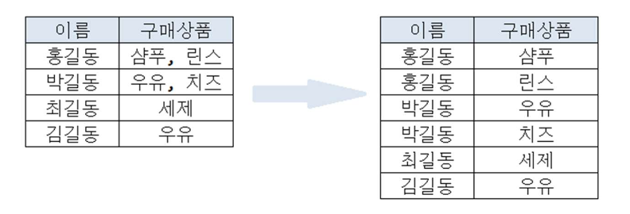
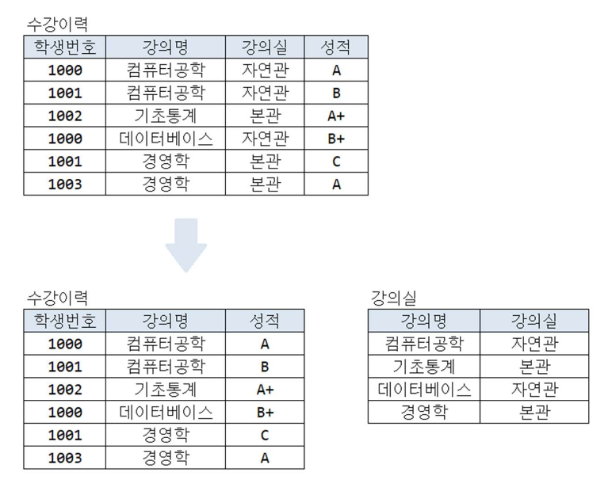
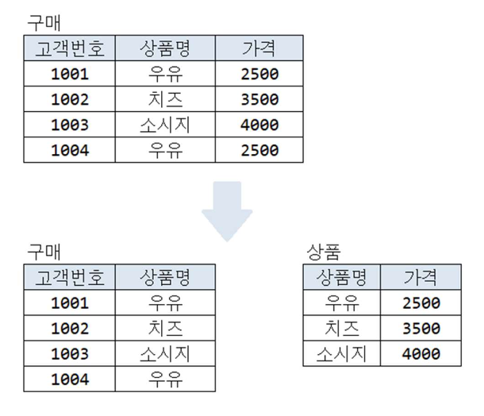
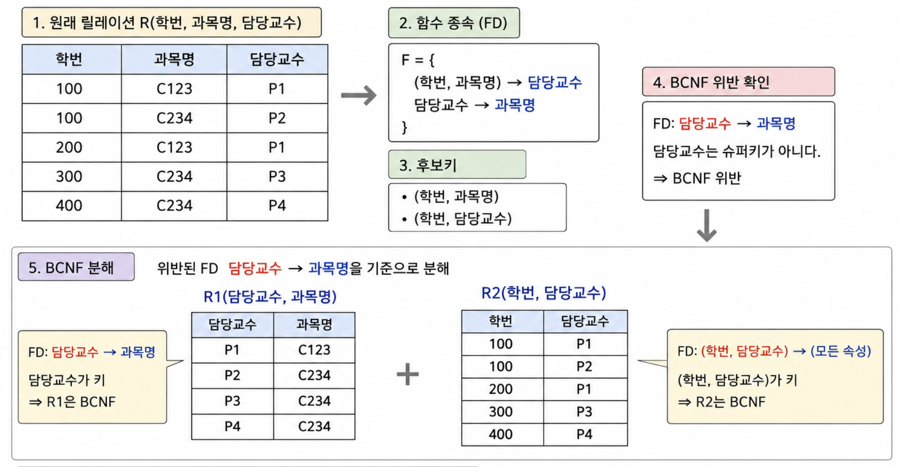
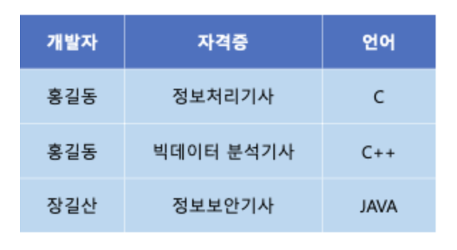
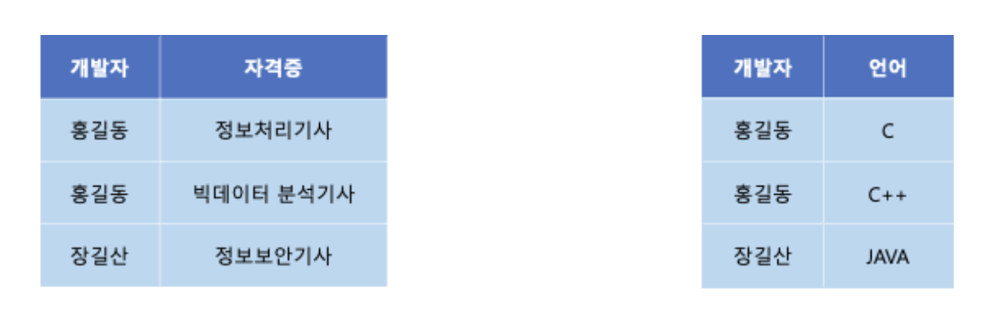
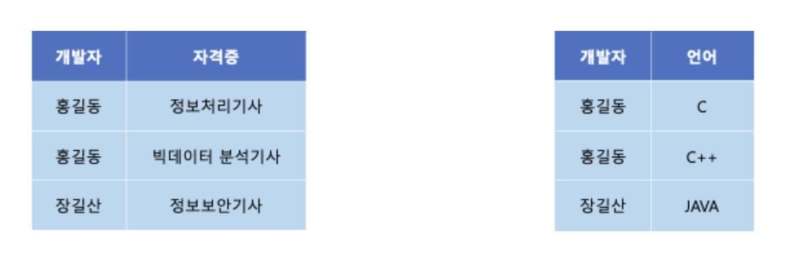
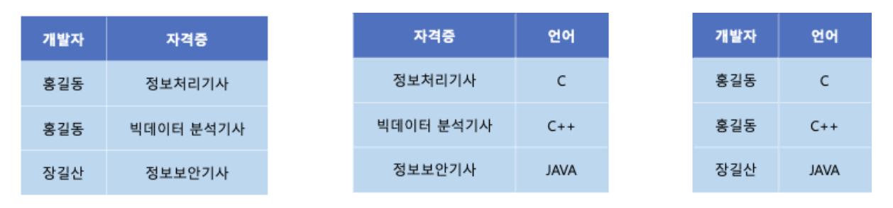

# 정규화

모델링 시 최대한 중복 데이터를 허용하지 않아야 저장공간의 효율적 사용과 업무 프로세스의 성능을 기대할 수 있다.

이러한 중복 데이터를 허용하지 않는 방식으로 테이블을 설계하는 방식을 정규화라고 한다.

1. 정규화란?
2. 정규화가 필요한 이유
3. 정규화 종류

## 1. 정규화(DB Normalization)의 개념

- 하나에 엔터티에 많은 속성을 넣게 되면, 해당 엔터티를 조회할 때 마다 많은 양의 데이터가 조회될 것이므로
  최소한의 데이터만을 하나의 엔터티에 넣는식으로 데이터를 분해하는 과정을 정규화라고 한다.
- 데이터의 일관성, 최소한의 데이터 중복, 최대한의 데이터 유연성을 위한 과정이라고 볼 수 있다.
- 데이터의 중복을 제거하고 데이터 모델의 독립성을 확보하기 위함이다.
- 데이터 이상현상을 줄이기 위한 데이터 베이스 설계 기법이다.
- 제 1 정규화부터 제 5 정규화까지 존재하며, 실질적으로는 제 3 정규화까지만 수행한다.

> **이상 현상이란?**
>
> 테이블에 중복 데이터가 많아 데이터 삽입, 수정, 삭제 시 의도하지 않은 문제가 발생하는 현상이다.

## 2. 정규화 단계

### 2.1 제 1 정규화(1NF)

- 테이블의 컬럼이 원자성을 갖도록 테이블을 분해하는 단계
- 하나의 행과 컬럼의 값이 반드시 한 값만 입력되도록 행을 분리하는 단계

### 2.2 제 2 정규화(2NF)

- 제 1 정규화를 진행한 테이블에 대해 완전 함수 종속을 만들도록 테이블을 분해한다.
- 기본키의 부분 집합이 다른 컬럼과 1:1 대응 관계를 갖지 않는 상태를 의미한다.

> **완전 함수 종속이란?**
>
> 기본키를 구성하는 모든 컬럼의 값이 다른 컬럼을 결정짓는 상태이다.

### 2.3 제 3 정규화(3NF)

- 제 2 정규화를 진행한 테이블에 대해 이행적 종속을 없애도록 테이블을 분리한다.
- A -> B, B-> C 의 관계가 성립할 때, (A,B)와 (B,C)로 분리하는 것이 제 3 정규화이다.

> **이행적 종속성이란?**
>
> A -> B, B-> C 의 관계가 성립할 때, A -> C 가 성립되는 것을 의미한다.

### 2.4 BCNF(Boyce-Codd Normal Form) 정규화

- 모든 결정자가 후보키가 되도록 테이블을 분해하는 것이다.
- 결정자가 후보키가 아닌 다른 컬럼에 종속되면 안된다.
- 제 3 정규형을 더 강화시킨 개념이다.

> **함수 종속이란?**
>
> 어떤 속성 A 의 값이 정해졌을 때 다른 속성 B 의 값이 하나로 결정되는 관계이다. A -> B 로 표현한다.

> **결정자란?**
>
> A 속성이 B 속성의 값을 결정하게 되면, 이 때 A 는 B 의 결정자라고 하며, 반대로 B 는 A 에 종속된다
> 표현한다.

> **후보키란?**
>
> 튜플을 유일하게 식별할 수 이는 속성의 최소 집합이다.

### 2.5 제 4 정규화

- BCNF 를 만족하는 테이블에 대해 다치 종속을 제거하도록 테이블을 분해한다.
- 하나의 컬럼 값에 대해 서로 독립적인 여러 값들이 반복될 때 발생하는 중복을 제거하는 단계이다.
- 실무에서는 제 3 정규화까지 주로 수행하고, 제 4 정규화부터는 개념 위주로 알아두는 경우가 많다.

> **다치 종속이란?**
>
> A 값 하나에 대해 B 값이 여러 개 존재할 수 있고, B 와 다른 속성이 서로 독립적으로 반복되는 관계이다.

### 2.6 제 5 정규화

- 제 4 정규화를 진행한 테이블에 대해 조인 종속을 제거하도록 테이블을 분해한다.
- 테이블을 더 작은 테이블로 분해한 뒤 다시 조인했을 때 원래 데이터가 손실 없이 복원되어야 한다.
- 너무 세밀하게 분해되면 조인이 많아져 성능이 떨어질 수 있어 실무에서는 거의 사용하지 않는다.

> **조인 종속이란?**
>
> 하나의 테이블을 여러 테이블로 분해한 뒤 조인했을 때 원래 테이블이 정확히 복원되는 관계이다.

### 2.7 반정규화

- 정규화된 테이블을 조회 성능 향상을 위해 의도적으로 합치거나 중복 데이터를 허용하는 과정이다.
- 조인이 너무 많아 성능이 떨어지는 경우, 자주 조회되는 데이터를 중복 저장해 조회 속도를 높인다.
- 데이터 중복으로 인해 삽입, 수정, 삭제 시 이상 현상이 발생할 수 있으므로 신중하게 적용해야 한다.
