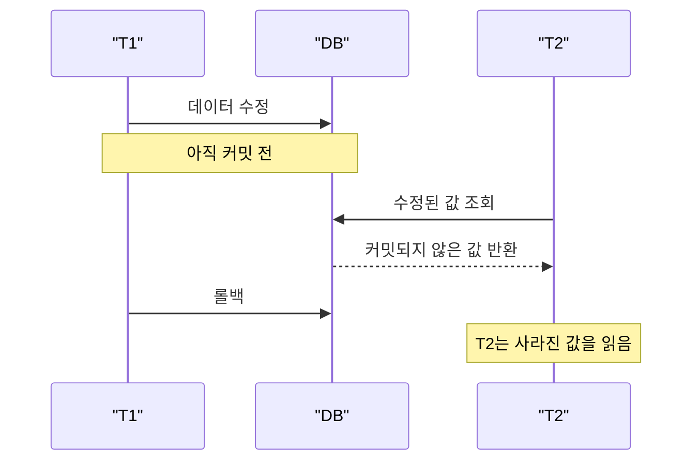
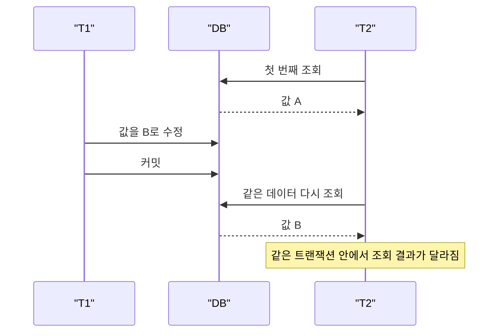
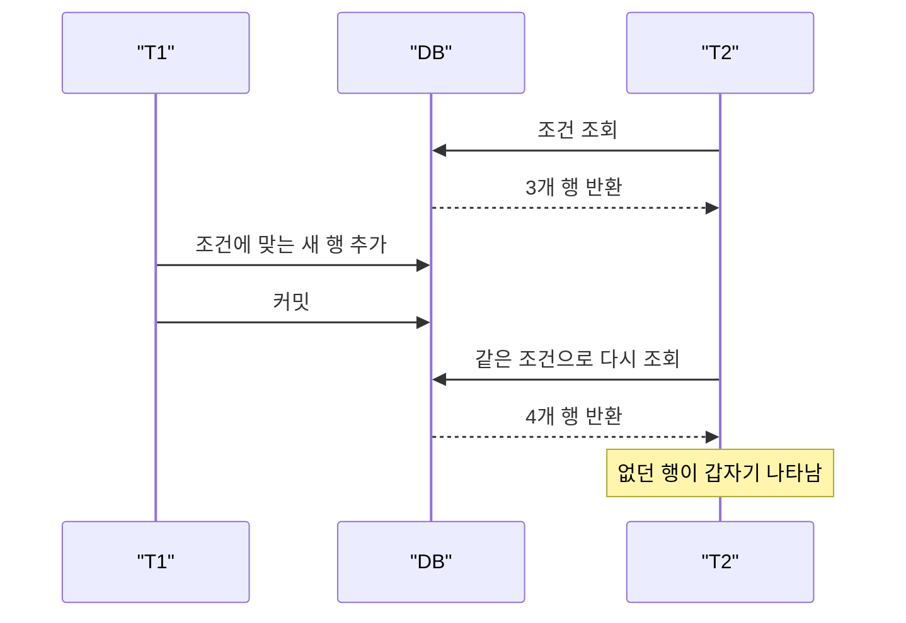
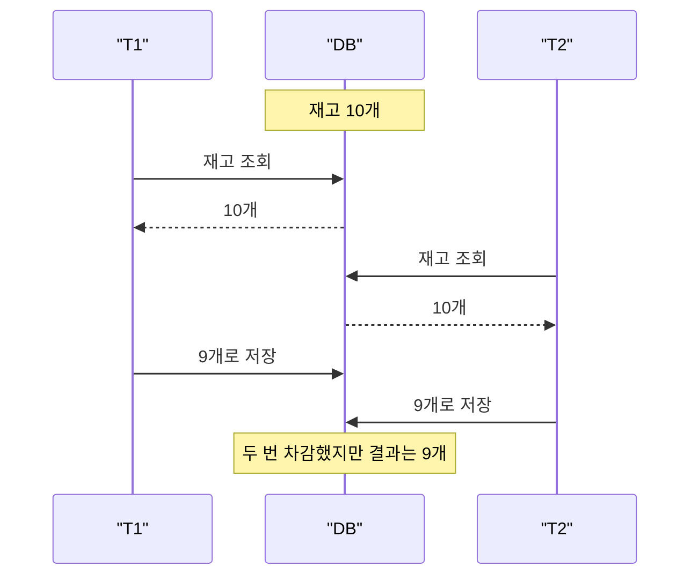
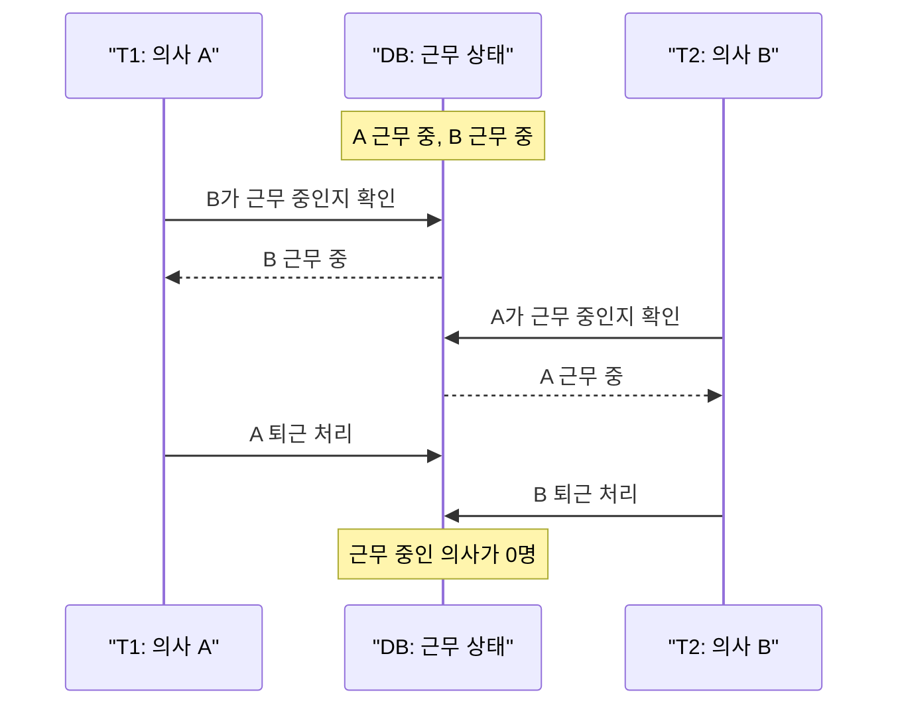
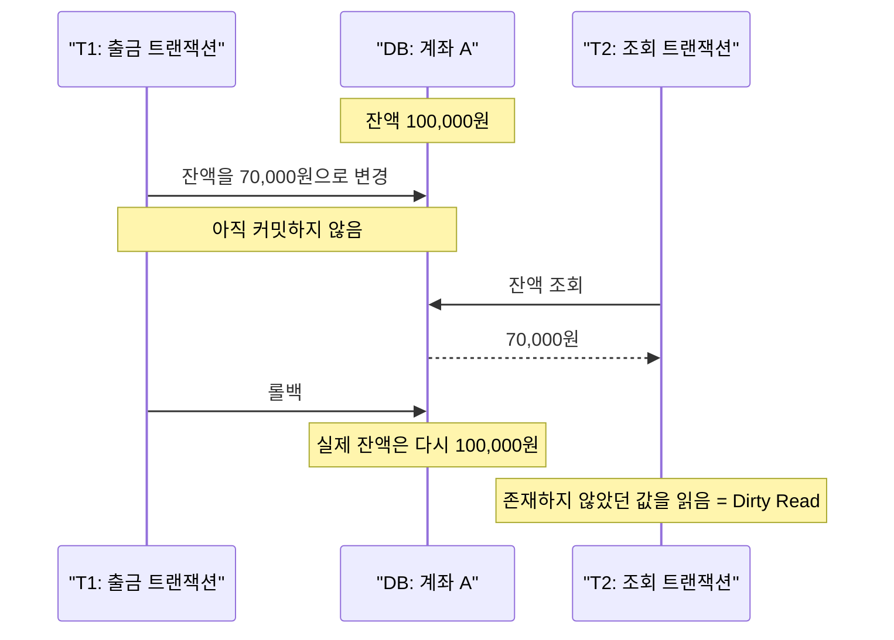
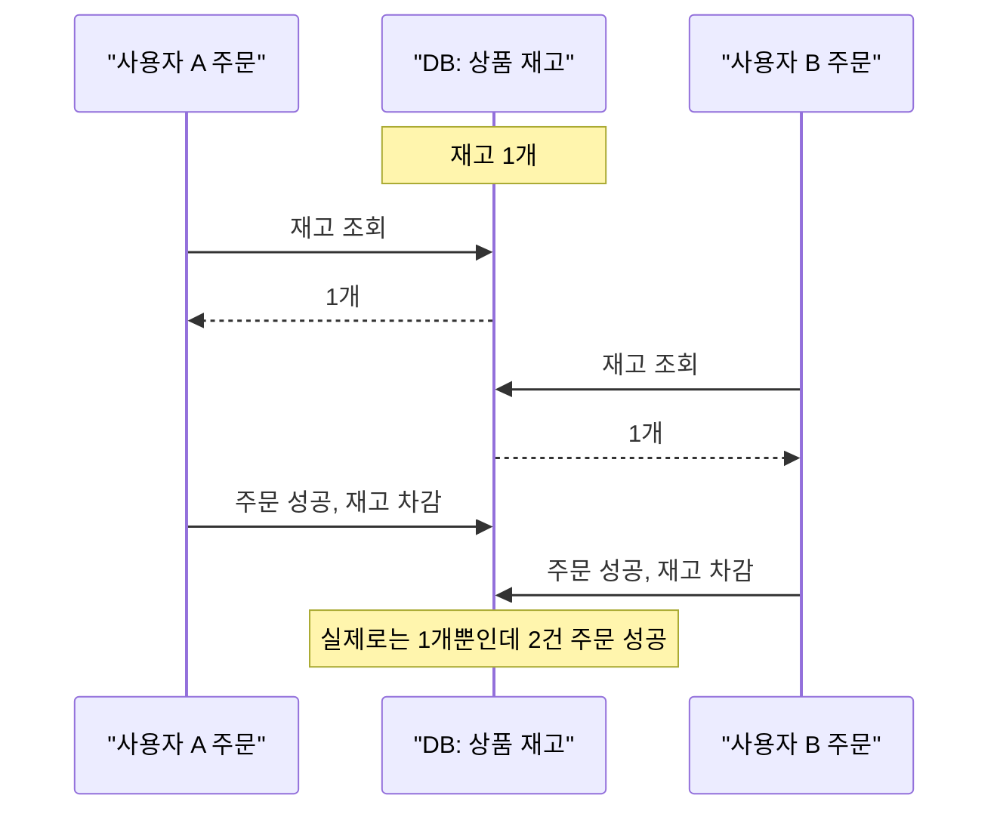
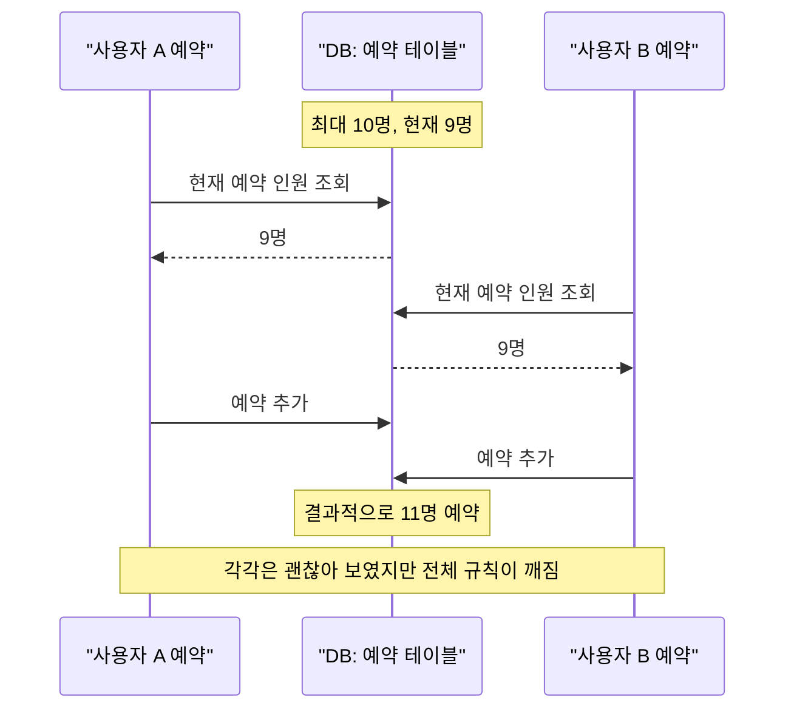

# 트랜잭션 격리 수준

## 1. 대표적인 이상 현상

트랜잭션 격리 수준을 이해하려면 먼저 동시성 환경에서 어떤 문제가 생기는지 알아야 한다.

여러 트랜잭션이 동시에 같은 데이터를 읽고 수정하면, 데이터베이스는 성능과 정합성 사이에서 균형을 잡아야 한다. 이때 격리 수준이 낮으면 성능은 좋아질 수 있지만, 예상하지 못한 읽기 결과가 발생할 수 있다.

### Dirty Read

아직 커밋되지 않은 데이터를 다른 트랜잭션이 읽는 현상이다.

예를 들어 A 트랜잭션이 잔액을 10,000원에서 5,000원으로 변경했지만 아직 커밋하지 않았다. 이때 B 트랜잭션이 5,000원을 읽었는데, 이후 A 트랜잭션이 롤백되면 B는 실제로 존재하지 않았던 값을 읽은 셈이 된다.

### Non-Repeatable Read

같은 트랜잭션 안에서 같은 데이터를 두 번 읽었는데, 두 읽기 결과가 달라지는 현상이다.

예를 들어 B 트랜잭션이 회원 등급을 처음에는 `BASIC`으로 읽었다. 그런데 중간에 A 트랜잭션이 해당 회원 등급을 `VIP`로 바꾸고 커밋했다. 이후 B 트랜잭션이 같은 회원을 다시 조회하면 `VIP`가 보일 수 있다.

### Phantom Read

같은 조건으로 여러 번 조회했는데, 이전에는 없던 행이 나타나거나 있던 행이 사라지는 현상이다.

예를 들어 B 트랜잭션이 "예약 가능한 좌석" 목록을 조회했을 때 3개가 나왔다. 그 사이 A 트랜잭션이 새로운 좌석을 추가하고 커밋하면, B가 같은 조건으로 다시 조회했을 때 4개가 보일 수 있다.

### Lost Update

두 트랜잭션이 같은 데이터를 동시에 수정했는데, 한쪽의 수정 결과가 덮어써져 사라지는 현상이다.

예를 들어 재고가 10개일 때 A와 B가 동시에 재고를 1개씩 차감한다. 둘 다 처음 재고 10개를 읽고 각각 9개로 저장하면, 실제로는 2개가 팔렸지만 재고는 9개로 남는다.

### Write Skew

각 트랜잭션이 서로 다른 데이터를 수정했지만, 전체 비즈니스 규칙이 깨지는 현상이다.

예를 들어 병원에는 항상 최소 한 명의 의사가 대기해야 한다는 규칙이 있다. 의사 A와 의사 B가 동시에 "다른 의사가 대기 중이니 나는 퇴근해도 된다"고 판단하고 각각 자신의 상태를 퇴근으로 바꾸면, 결과적으로 아무도 대기하지 않는 상태가 된다.

## 2. SQL 표준 격리 수준

SQL 표준은 트랜잭션 격리 수준을 네 단계로 정의한다.

격리 수준이 높아질수록 데이터 정합성은 강해지지만, 동시에 처리할 수 있는 성능은 낮아질 수 있다.

### Read Uncommitted

가장 낮은 격리 수준이다.

다른 트랜잭션이 아직 커밋하지 않은 데이터도 읽을 수 있다. Dirty Read가 발생할 수 있기 때문에 일반적인 서비스에서는 거의 사용하지 않는다.

### Read Committed

커밋된 데이터만 읽을 수 있다.

Dirty Read는 막을 수 있지만, 같은 트랜잭션 안에서 같은 데이터를 다시 읽을 때 값이 달라지는 Non-Repeatable Read는 발생할 수 있다.

많은 데이터베이스에서 기본 격리 수준으로 사용된다.

### Repeatable Read

같은 트랜잭션 안에서 같은 데이터를 반복해서 읽으면 항상 같은 결과를 보장한다.

Non-Repeatable Read를 막을 수 있다. 다만 데이터베이스 구현 방식에 따라 Phantom Read가 발생할 수도 있고, 발생하지 않을 수도 있다.

MySQL InnoDB는 기본 격리 수준이 Repeatable Read이며, MVCC와 Next-Key Lock을 사용해 많은 경우 Phantom Read를 방지한다.

### Serializable

가장 높은 격리 수준이다.

여러 트랜잭션이 동시에 실행되더라도, 마치 순서대로 하나씩 실행된 것처럼 결과를 보장한다. 정합성은 가장 강하지만 락 대기, 충돌, 성능 저하가 커질 수 있다.

## 3. 격리 수준별 동작 비교

| 격리 수준 | Dirty Read | Non-Repeatable Read | Phantom Read |
| --- | --- | --- | --- |
| Read Uncommitted | 발생 가능 | 발생 가능 | 발생 가능 |
| Read Committed | 방지 | 발생 가능 | 발생 가능 |
| Repeatable Read | 방지 | 방지 | 구현에 따라 다름 |
| Serializable | 방지 | 방지 | 방지 |

이 표는 SQL 표준 관점의 일반적인 정리다.

실제 데이터베이스에서는 같은 이름의 격리 수준이라도 구현 방식에 따라 동작이 달라질 수 있다. 따라서 실무에서는 "격리 수준 이름"만 볼 것이 아니라, 사용하는 데이터베이스의 문서와 동작 방식을 함께 확인해야 한다.

### 왜 mysql에서는 Repeatable Read를 사용할까요?
이건 예전에 replication을 사용하던 것과 관련이 있다.  과거 MySQL은 statement-based replication을 많이 썼는데, READ COMMITTED에서는 같은 SQL 문이 실행 시점에 따라 다른 결과를 만들 가능성이 커져 복제 일관성에 불리했다. REPEATABLE READ가 더 예측 가능한 실행 결과를 주기 때문에 기본값으로 적합하다고 한다. (SBR은 명령어를 다 모아놨다가 하나씩 실행, RBR은 한 줄 씩 그대로 복제)
 + Repeatable Read를 쓰면 최신 데이터를 아예 못 보지 않나? 라고 생각할 수 있는데, FOR UPDATE 처럼 락을 걸었던 경우에는 최신 데이터를 보여준다. 또한 GAP LOCK을 통해 PHANTOM READ를 막는다.  자세한 설명은 DB에서.. 

### 격리 수준을 볼 때의 핵심 질문

- 이 트랜잭션은 커밋되지 않은 데이터를 읽어도 되는가?
- 같은 트랜잭션 안에서 같은 조회 결과가 반드시 같아야 하는가?
- 조건 검색 결과에 새로운 행이 끼어들면 문제가 되는가?
- 성능보다 정합성이 더 중요한 작업인가?
- 충돌이 발생했을 때 재시도 로직을 둘 수 있는가?

## 4. 예제로 이해하기

### 예제 1. 계좌 이체

상황은 다음과 같다.

- 계좌 A의 잔액은 100,000원이다.
- 트랜잭션 T1은 계좌 A에서 30,000원을 출금한다.
- 트랜잭션 T2는 계좌 A의 잔액을 조회한다.
- T1은 아직 커밋하지 않았다.

Read Uncommitted에서는 T2가 70,000원을 읽을 수 있다. 그런데 T1이 롤백되면 실제 잔액은 다시 100,000원이 된다. T2는 Dirty Read를 한 것이다.

Read Committed 이상에서는 T1이 커밋하기 전까지 T2는 변경 전 값인 100,000원을 읽는다.

### 예제 2. 재고 차감

상황은 다음과 같다.

- 상품 재고는 1개다.
- 사용자 A와 사용자 B가 동시에 주문한다.
- 두 트랜잭션 모두 재고가 1개인 것을 확인한다.
- 둘 다 주문을 성공 처리하고 재고를 차감하려고 한다.

이 경우 단순히 트랜잭션만 사용한다고 문제가 해결되지는 않는다.

격리 수준이 낮거나 적절한 락이 없다면 두 주문이 모두 성공할 수 있다. 결과적으로 재고는 음수가 되거나, 둘 중 하나의 갱신이 덮어써질 수 있다.

실무에서는 다음과 같은 방법을 함께 고려한다.

- `SELECT ... FOR UPDATE` 같은 명시적 락
- 낙관적 락
- 재고 차감 쿼리의 조건부 업데이트
- 충돌 발생 시 재시도

### 예제 3. 예약 시스템

상황은 다음과 같다.

- 한 시간대에는 최대 10명까지만 예약할 수 있다.
- 현재 예약 인원은 9명이다.
- 사용자 A와 사용자 B가 동시에 예약을 시도한다.
- 두 트랜잭션 모두 현재 예약 인원을 9명으로 조회한다.

두 트랜잭션이 모두 "아직 1자리가 남았다"고 판단하면 예약 인원이 11명이 될 수 있다.

이 문제는 단순한 Dirty Read나 Non-Repeatable Read보다 비즈니스 규칙 관점에서 더 중요하다. 서비스에서는 이런 경우 격리 수준만 믿기보다, 유니크 제약 조건, 조건부 업데이트, 명시적 락, 재시도 전략을 함께 설계해야 한다.

## 5. 정리

트랜잭션 격리 수준은 동시성 환경에서 데이터 정합성을 어디까지 보장할지 정하는 기준이다.

격리 수준이 낮으면 동시 처리 성능은 좋아질 수 있지만 Dirty Read, Non-Repeatable Read, Phantom Read 같은 이상 현상이 발생할 수 있다.

격리 수준이 높으면 정합성은 강해지지만 락 대기, 데드락, 충돌, 재시도 비용이 증가할 수 있다.

따라서 실무에서 중요한 것은 무조건 높은 격리 수준을 선택하는 것이 아니다. 비즈니스 규칙상 절대 깨지면 안 되는 조건이 무엇인지 파악하고, 데이터베이스의 실제 동작 방식에 맞게 격리 수준, 락, 제약 조건, 재시도 전략을 함께 설계해야 한다.

핵심은 다음 세 가지다.

- 격리 수준은 정합성과 성능 사이의 선택이다.
- 같은 격리 수준 이름이라도 데이터베이스마다 동작이 다를 수 있다.
- 트랜잭션만으로 모든 동시성 문제가 자동으로 해결되지는 않는다.
