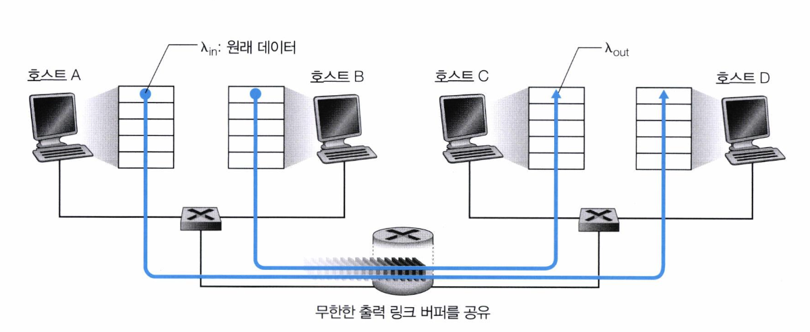
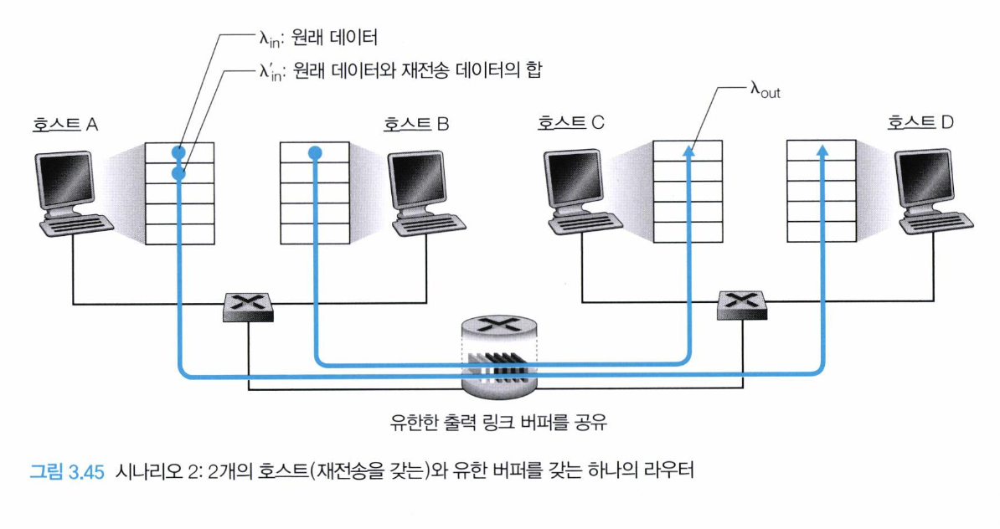
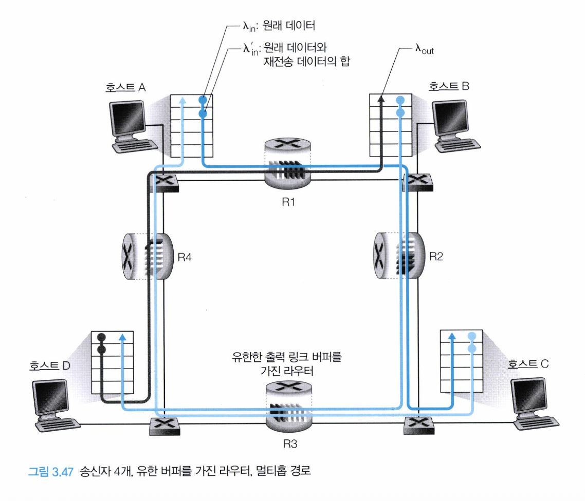

# TCP의 혼잡 제어란?

네트워크 혼잡으로 인해 발생하는 패킷 손실과 지연을 줄이기 위해
송신자의 전송 속도를 조절하는 메커니즘이다.

TCP는 네트워크 상태를 관찰하며 혼잡 여부를 추정하고,
혼잡이 발생하면 전송률을 감소시킨다.

## 1. 네트워크 혼잡이 발생하는 경우

### 시나리오 1: 2개의 송신자와 무한 버퍼를 갖는 하나의 라우터

- 혼잡 지점: 라우터 안에 큐잉된 패킷의 평균 개수는 제한되지 않고
  출발지와 목적지 사이의 평균 지연이 무제한이 된다.

### 시나리오 2: 2개의 송신자, 유한 버퍼를 가진 하나의 라우터

- 혼잡 지점: 버퍼가 유한하기 때문에 패킷 로스가 발생하고,
  재전송 데이터로 인해 수신자가 받는 실제 데이터의 처리량은 낮아진다.

### 시나리오 3: 4개의 송신자와 유한 버퍼를 갖는 라우터, 그리고 멀티홉 경로

- 혼잡 지점: 멀티홉 네트워크에서 혼잡으로 패킷이 중간에 손실되면,
  이미 사용한 네트워크 자원이 낭비되고 재전송이 발생하여 혼잡이 더욱 악화된다.

> **홉이란?**
>
> 패킷이 라우터 하나를 거쳐 다음 장비로 이동하는 것

## 2. 혼잡 제어 접근법

### 종단 간의 혼잡 제어(End-to-End Congestion Control)

- 네트워크 계층은 트랜스포트 계층에 혼잡 정보를 주지 않는다.
- TCP는 패킷 손실, 중복 ACK, RTT 증가 등을 통해 혼잡 윈도(Congestion Window)의 크기를 조절한다.

> **RTT란**
>
> 데이터 패킷이 송신지에서 목적지로 이동한 후 다시 송신지(출발지)로 돌아오는 데 걸리는 총 시간

> **혼잡 윈도(Congestion Window, cwnd)란?**
>
> TCP 송신자가 현재 네트워크가 수용할 수 있다고 판단하는 데이터의 양을 의미한다.
>
> TCP는 패킷 손실, 중복 ACK, RTT 증가 등의 신호를 통해 네트워크 혼잡 여부를 추정하며,
> 혼잡이 없다고 판단하면 cwnd를 증가시키고, 혼잡이 발생했다고 판단하면 cwnd를 감소시킨다.
>
> 따라서 cwnd는 TCP가 네트워크 혼잡을 방지하기 위해 전송 속도를 조절하는 핵심 메커니즘이다.

### 네트워크 지원 혼잡 제어

- 라우터들은 네트워크 안에서 혼잡 상태와 관련하여 송신자나 수신자 또는 모두에게 직접적인 피드백을 제공한다.